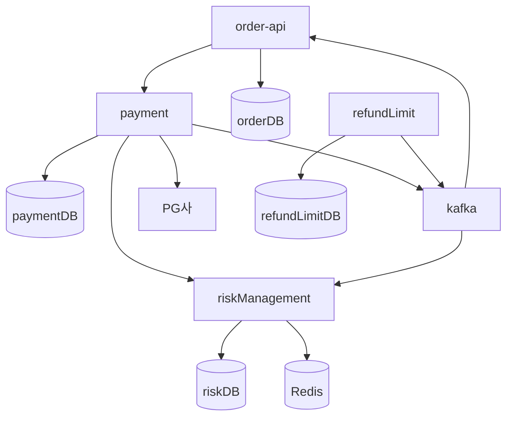
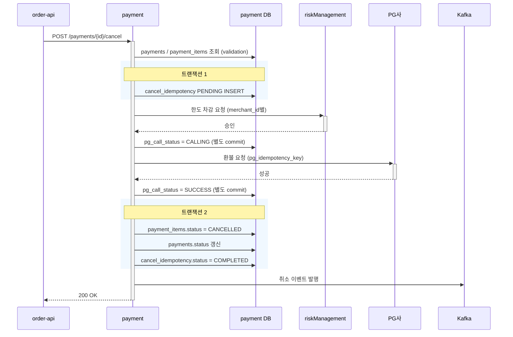
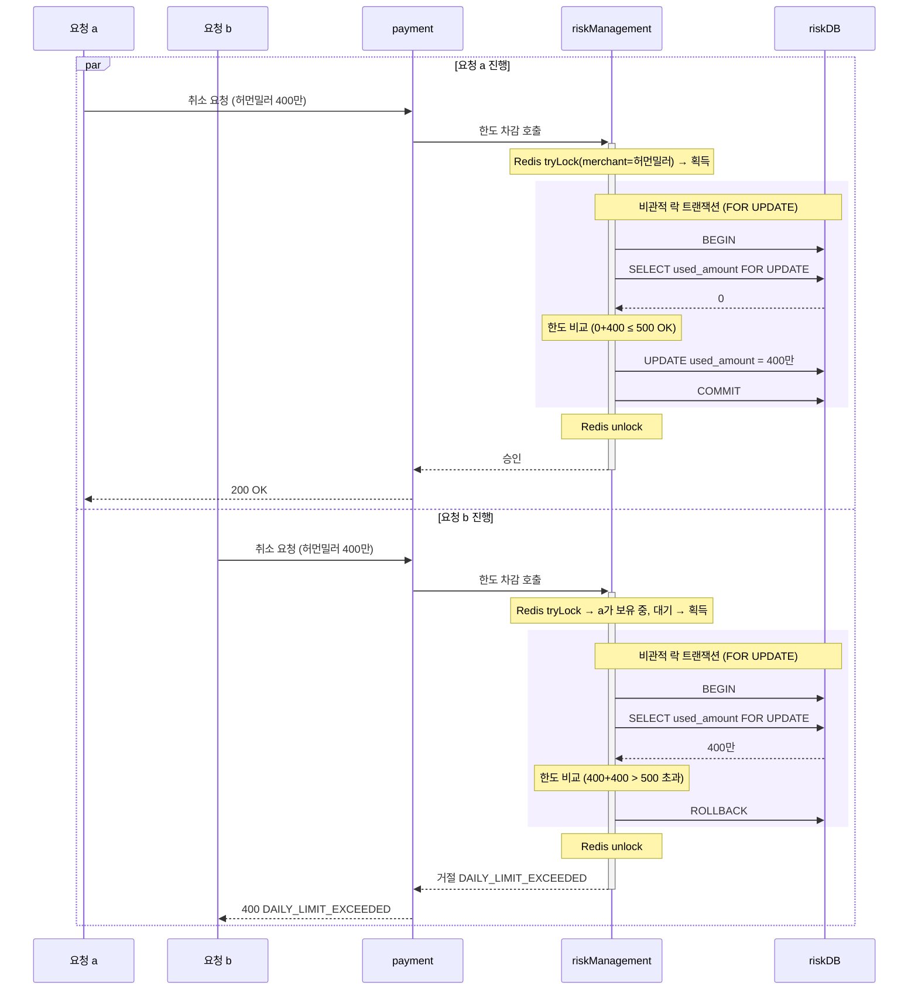
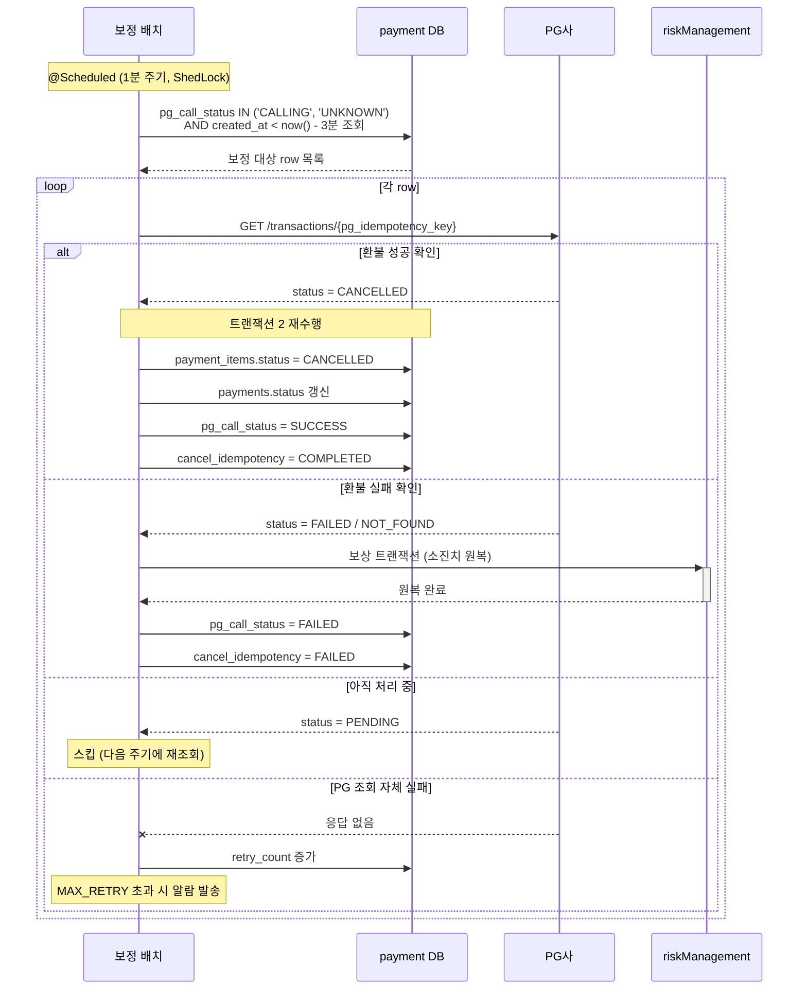
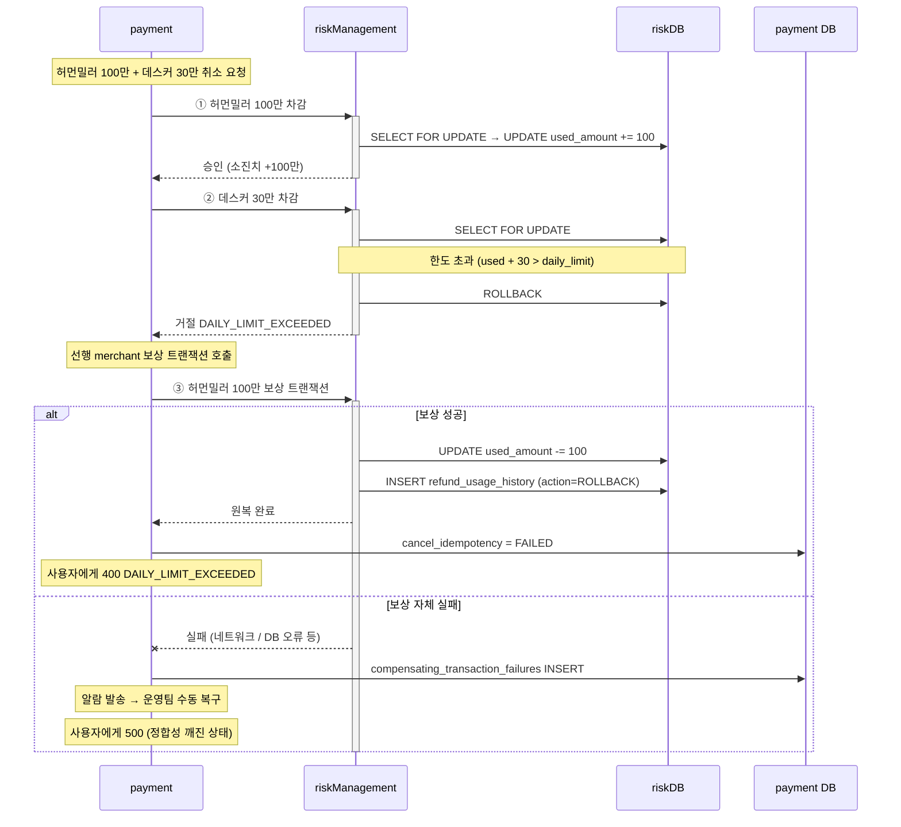

# 결제 취소 시스템 디자인 리뷰 문서

## 1. 요구사항

### 배경

주문에 대한 환불을 처리할 때, 주문 서버가 환불 처리까지 담당하면 너무 많은 책임을 갖게 된다. 그러므로 환불 처리를 진행하는 별도 서버 클러스터를 두어 책임을 분리한다. 환불은 실제 돈의 이동을 수반하는 작업이므로, 책임 분리와 더불어 안정적인 처리가 필수적이다.

### 목표

- 결제 취소 API 구축 (전체 취소 / 부분 취소)
- 동일 취소 요청의 중복 처리 방지 (멱등성)
- 판매업체별 일일 한도 초과 방지 (동시성)
- 취소 이벤트를 Kafka로 발행하여 주문/적립금/정산 서버에 전파
- 판매업체 일일 한도 변경의 실시간 전파 (한도 검증 시스템에 즉시 반영)
- TPS 100 기준 설계, TPS 1000 / 10000 확장 고려

### 제약사항

- 현재 시스템 환경: TPS 100
- 각 서버 / Kafka / DB는 별도 인스턴스로 운영 (네트워크 분리)
- 하나의 결제건에 여러 상품이 포함될 수 있으며, 상품 단위 부분 취소 가능
- 주문 서버의 주문 flow 및 결제 API는 이미 구축되어 있음 (본 프로젝트 범위 밖)
- 취소 요청은 payment 서버로 들어옴 (entry point)

### 핵심 문제

본 시스템이 풀어야 하는 어려운 문제들. "이 시스템이 단순한 PG 호출 1번이 아닌 이유"를 정리한다.

| # | 문제 | 무엇이 어려운가 |
|---|---|---|
| 1 | **멱등성** | 네트워크 타임아웃·서버 재시도 환경에서 동일 요청이 여러 번 도달할 수 있음. **부분 취소가 가능**하므로 단순 결제건 단위 멱등성으로는 부족하고, 같은 결제건이라도 취소 대상 상품이 다르면 별개 요청으로 다뤄야 함. 또한 클라이언트가 키를 생성하면 악의적 요청을 막을 수 없어 **서버 측에서 멱등성을 책임져야** 함. |
| 2 | **동시성** | 판매업체 일일 한도라는 **공유 자원**을 여러 사용자의 취소 요청이 동시에 차감하려 함. "한도 검사 → 차감"이 원자적이지 않으면 두 요청 모두 한도 검사를 통과한 뒤 차감하여 한도 초과가 발생할 수 있음. 또한 서비스가 분산 환경(서버 다중 인스턴스)이라 단일 프로세스 락으로는 부족하고, **인스턴스 간 공유된 락 메커니즘**이 필요함. |
| 3 | **분산 시스템 장애 처리** | 글로벌 트랜잭션을 쓸 수 없는 환경에서 payment / riskManagement / PG / Kafka 4개 시스템이 관여. 중간 실패 시 **어디까지 처리됐는지** 추적이 필요하고, 부분적으로만 처리된 상태(소진치는 차감됐는데 PG 실패 등)를 정합성 있게 회복해야 함. 특히 PG 호출은 타임아웃 시 **"환불이 실제로 일어났는지 알 수 없는" 불확실 상태**가 발생할 수 있어, 이를 명시적으로 추적하고 사후에 보정하는 메커니즘이 필요함. |
| 4 | **확장성** | TPS 증가 시 **판매업체별 한도 차감이 가장 큰 병목**. 같은 판매업체의 한도 row 1개에 모든 취소 요청이 몰리는 hot row 문제가 발생. 일반적인 확장 전략(read replica, 샤딩)도 효과가 제한적임 — read replica는 쓰기 분산 불가, 샤딩은 인기 판매업체가 여전히 hot shard가 됨. 따라서 **단순 인프라 확장이 아니라 락 메커니즘·캐싱 전략 차원의 설계 결정**이 필요. |

---

## 2. 유저 시나리오

### 정상 플로우

| # | 시나리오 | 결과 |
|---|---|---|
| 1 | 단일 상품 전체 취소 (예: 허먼밀러 100만 1건 결제) | `payments.status`: PAID → CANCELLED |
| 2 | 복수 상품 동시 전체 취소 (예: 허먼밀러 100만 + 데스커 30만, 둘 다 취소) | `payments.status`: PAID → CANCELLED |
| 3 | 부분 취소 (예: 허먼밀러 + 데스커 중 허먼밀러만 취소) | `payments.status`: PAID → PARTIALLY_CANCELLED, 데스커는 PAID 유지 |
| 4 | 부분 취소 후 나머지 취소 (시나리오 3 후 데스커도 취소) | PARTIALLY_CANCELLED → CANCELLED |

### 엣지 케이스

**5. 동일 요청 중복 취소 시도**

사용자가 동일한 `payment_id + items`로 재요청하는 상황. 서버가 동일 idempotency_key를 생성하여 `cancel_idempotency` 상태로 분기 처리한다.
- **COMPLETED**: 기존 결과 반환 (재처리 없음)
- **PENDING**: 409 `CANCEL_IN_PROGRESS` (처리 중)
- **FAILED**: row를 PENDING으로 UPDATE → 신규 처리
- **없음**: 신규 처리

**6. 한도 초과 동시 요청**

a, b 유저가 같은 판매업체(예: 허먼밀러)의 상품을 동시에 400만원씩 취소 요청. 일일 한도 500만원이라 한 명만 성공해야 함.

시스템은 **분산 락(Redis) + DB 비관적 락(`FOR UPDATE`) 중첩**으로 직렬화 처리. 분산 락이 1차로 한 인스턴스만 통과시켜 DB 부하를 줄이고, DB 락이 2차로 정합성을 보장한다. 누가 먼저 락을 선점할지는 보장되지 않지만, **선점한 요청은 통과 / 후속 요청은 한도 비교 후 거절**.

실패 응답: 400 `DAILY_LIMIT_EXCEEDED` (한도가 변하지 않으면 재시도해도 실패하므로 4xx).

**7. 네트워크 타임아웃 후 재시도**

클라이언트가 환불 요청을 보냈으나 네트워크 문제로 응답을 못 받은 상황. 두 가지 케이스 — 응답이 끊어졌지만 서버는 정상 처리 완료(COMPLETED), 또는 서버가 아직 처리 중(PENDING). 클라이언트는 응답을 못 받았으므로 재시도한다.

시스템은 동일 `payment_id + items`로 동일 idempotency_key를 생성하여 [시나리오 5](#엣지-케이스)와 같은 분기 처리를 한다 — COMPLETED면 기존 결과 반환, PENDING이면 409, FAILED면 PENDING으로 UPDATE 후 재처리.

이 시나리오가 **멱등성이 진짜 필요한 핵심 이유**다. 사용자 의도와 무관하게 분산 시스템에서 자연 발생하는 상황이며, 멱등성이 없으면 환불이 두 번 발생할 수 있다.

**8. 이미 취소된 상품 재취소 시도**

사용자가 이미 취소된 상품을 다시 취소 요청. 같은 idempotency_key 재요청과는 다른 케이스 — items 구성이 달라지면 키도 달라지므로 멱등성 키로는 못 잡는다.

시스템은 **validation 단계**에서 `payment_items.status`를 체크하여 CANCELLED인 items가 포함되어 있으면 400 `ALREADY_CANCELLED` 응답. 멱등성 키 생성 이전 단계에서 차단되므로 불필요한 처리 자원을 쓰지 않는다.

validation = "데이터 상태" 검사 / 멱등성 = "요청 중복" 검사 — 두 단계가 하는 일이 다름.

**9. 취소 처리 중 서버 장애 / PG 결과 불확실**

환불 처리 5단계(멱등성 키 INSERT → 한도 차감 → PG 호출 → 트랜잭션 2 → Kafka 발행) 중 어느 단계에서든 장애나 PG 결과 불확실이 발생할 수 있다. 핵심 함정은 PG 호출 타임아웃 시 **"PG가 환불을 했는지 안 했는지 모름"** 상태가 되며, 단순 재시도 시 이중 환불 위험이 있다는 점.

**두 가지 복구 메커니즘이 같이 작동:**

- **동기 보상 트랜잭션** (PG가 명시적 실패 응답): HTTP 4xx/5xx 응답 받으면 PG가 환불 안 했음이 확정. 응답 받은 자리에서 즉시 한도 원복 + `cancel_idempotency = FAILED` 마킹.

- **비동기 보정 배치** (PG 응답 없음 / 서버 다운): 타임아웃·네트워크 오류는 HTTP 응답 자체가 없는 예외 상황으로, `pg_call_status`가 UNKNOWN 또는 CALLING(stuck) 상태가 됨. PENDING이 5분 이상 지속되면 배치가 **PG에 직접 조회하여 환불 진실 확인** 후 보정. PG 호출 시 `pg_idempotency_key` 사용으로 PG 자체 멱등성도 활용.

**핵심 원칙**: 타임아웃 = "실패"가 아니라 "**불확실(UNKNOWN)**". 추측해서 보상 트랜잭션 함부로 호출하면 PG가 실제로 환불한 경우 사용자에게 거짓말이 됨. **PG 조회로 진실 확인 후 결정**이 본 시스템 분산 처리 설계의 핵심.

**응답 처리**: 타임아웃 시 즉시 500 반환하지만, "환불 실패 확정"이 아니라 UNKNOWN 상태. 정합성은 보정 배치가 백그라운드에서 회복하며, 클라이언트는 동일 요청을 재전송하여 멱등성 키 기반 응답으로 최종 결과를 확인 가능 (별도 GET 엔드포인트 없음).

**10. 복수 상품 취소 중 일부 실패 → 전체 롤백**

한 결제건에 여러 판매업체 상품이 포함된 경우(예: 허먼밀러 100만 + 데스커 30만), payment 서버는 merchant 단위로 순차 차감을 시도한다. 중간에 한 merchant가 실패(예: 데스커 한도 초과)하면, **이미 성공한 선행 merchant의 차감을 보상 트랜잭션으로 원복**한 뒤 전체 실패로 응답.

**원자성 우선 결정**: 일부만 성공·일부 실패 상태로 두지 않음. UX 측면에서 사용자가 다시 시도해야 하는 불편함은 있지만, 돈을 다루는 시스템에서 부분 성공은 정합성을 깨뜨릴 위험이 더 큼.

"롤백"이 아니라 **보상 트랜잭션 호출** — 분산 환경에서는 한 시스템에서 이미 commit된 작업을 원복하려면 명시적인 역방향 호출이 필요하다.

**보상 트랜잭션 자체가 실패할 위험**: `compensating_transaction_failures` 테이블에 기록 + 알람 발송 → 운영팀 수동 복구 또는 재시도 배치.

응답: 400 `DAILY_LIMIT_EXCEEDED` (실패 사유 포함).

---

## 3. 시스템 아키텍처



### 서버별 책임

| 서버 | 책임 |
|---|---|
| payment | 취소 요청 진입점, 멱등성 관리, 취소 처리 오케스트레이션, PG 호출, Kafka 이벤트 발행 |
| riskManagement | 판매업체별 일일 한도 소진치 관리, 분산 락 + DB 락으로 동시 차감 처리 |
| refundLimit | 판매업체별 일일 한도 설정값 관리, 한도 변경 시 Kafka 이벤트 발행 |
| order-api | Kafka 취소 이벤트 수신 후 주문 상태 업데이트 (이번 프로젝트 범위 밖) |

### 인프라 컴포넌트

- **Kafka**: 비동기 이벤트 브로커 (취소 이벤트 / 한도 변경 이벤트)
- **Redis**: riskManagement에서 한도 캐싱 + 분산 락 용도 (상세는 동시성 설계 챕터 참고)
- **각 DB**: 서버별 격리 (paymentDB / riskDB / refundLimitDB / orderDB)

---

## 4. 핵심 플로우

본 장은 **정상 처리 1개 + 장애 발생 가능 지점 3개**의 시퀀스 다이어그램으로 구성. 4-1은 시스템이 어떻게 작동하는지 보여주고, 4-2~4-4는 각각 다른 종류의 어려움(동시성 충돌, PG 결과 불확실, 분산 트랜잭션 실패)을 어떻게 다루는지 시각화한다.

### 4-1. 정상 처리 (Happy Path)



**다이어그램이 보여주는 핵심 설계 결정:**

- **트랜잭션 1과 2가 분리**: 외부 호출(riskManagement, PG)을 트랜잭션 안에 넣으면 DB 락이 외부 응답 시간만큼 잡혀 부담이 큼. 외부 호출은 트랜잭션 *밖에서* 진행.
- **`pg_call_status`의 별도 commit**: PG 호출 직전·직후에 별도 commit으로 마킹. 만약 트랜잭션 2와 묶으면 PG 호출 중 서버 다운 시 CALLING 상태 자체가 사라져 보정 배치가 인지 못 함.
- **6개 참가자 분리**: payment 서버와 payment DB를 별도 lane으로 두어 트랜잭션 경계와 DB 호출이 명확히 보임.

### 4-2. 동시 한도 초과 (시나리오 6)



**다이어그램이 보여주는 핵심 설계 결정:**

- **분산 락과 비관적 락의 중첩(nested)**: 분산 락이 바깥에서 인스턴스 간 직렬화를 1차 수행, 비관적 락(`FOR UPDATE`)이 안쪽에서 트랜잭션 단위 정합성을 2차 보장. 락은 **LIFO 순서**로 해제 — 분산 락 → 비관적 락 순으로 들어가고, COMMIT(비관적 락 해제) → unlock(분산 락 해제) 순으로 나옴.
- **두 락의 역할 분담**: 분산 락 = DB 부하 절감 (DB까지 도달하는 트래픽 자체를 줄임). 비관적 락 = 마지막 정합성 보루 (Redis 장애여도 정합성 유지 가능).
- **누가 먼저 성공할지는 비결정적**: 락 선점 순서는 시스템이 결정하며 클라이언트가 미리 알 수 없음. 실패한 쪽은 400 `DAILY_LIMIT_EXCEEDED` 응답.

### 4-3. PG 상태 정합성 보정 (시나리오 9)



**다이어그램이 보여주는 핵심 설계 결정:**

- **PG 진실 조회 후 보정** — 단순 재시도가 아닌 "PG에 환불 여부를 직접 조회"가 핵심. 단순 재시도하면 PG가 이미 환불 처리한 경우 이중 환불 위험.
- **보정 대상 조건** `pg_call_status IN ('CALLING', 'UNKNOWN') AND created_at < now() - 3분` — 3분 유예로 정상 처리(수 초 내)와 race 회피.
- **`pg_idempotency_key`로 PG 조회** — 우리 내부 키와 분리되어 있어 PG 연동 변경에 격리. PG 호출의 외부 계약 격리.
- **4가지 분기 명시화** — 성공/실패/처리중/조회실패. "처리중"을 별도 분기로 두는 이유는 PG 자체가 비동기일 수 있어 즉답이 아닐 가능성 인정.
- **무한 재시도 방지** — `retry_count` 증가, MAX_RETRY 초과 시 알람 → 운영팀 인지 가능.

### 4-4. 복수 상품 부분 실패 (시나리오 10)



**다이어그램이 보여주는 핵심 설계 결정:**

- **순차 차감**: 다중 merchant를 병렬 호출이 아닌 순차 호출. 병렬 시 보상 처리가 복잡해지고 race 가능성. TPS 100 규모에서는 단순성 우선.
- **"롤백"이 아니라 보상 트랜잭션** — 분산 환경에서 한 시스템에서 이미 commit된 작업을 원복하려면 명시적인 역방향 호출 필요. SQL ROLLBACK과 다른 개념.
- **원자성 우선 결정**: 부분 성공 상태로 두지 않음. UX 손실(사용자 재시도 필요)이 있지만, 돈을 다루는 시스템에서 부분 성공은 정합성 위험이 더 큼.
- **보상 트랜잭션 자체의 위험 인지**: 보상도 실패 가능 → `compensating_transaction_failures` 기록 + 알람으로 다중 방어선 구축. 자동 회복 불가능한 상황을 운영팀이 인지할 수 있는 채널 마련.

---

## 5. Database Design

각 서버가 격리된 DB를 가짐. 서버간 데이터 공유는 API 호출 또는 Kafka 이벤트를 통해서만 이루어진다.

### 5-1. payment DB

본 시스템의 핵심 DB. 결제 본체(`payments`/`payment_items`)는 결제 API에서 이미 사용 중인 테이블이며, 본 프로젝트에서는 취소 처리에 필요한 컬럼·상태값 관점에서 정리한다. 멱등성·PG 호출 추적·실패 로그 테이블은 본 프로젝트에서 신규 도입.

#### `payments` (기존 테이블, 본 시스템은 status 변경)

```sql
CREATE TABLE payments (
    id              VARCHAR(64) PRIMARY KEY,    -- UUID 기반 결제 ID
    order_id        VARCHAR(64) NOT NULL,       -- 주문 식별자 (외부 참조)
    total_amount    BIGINT      NOT NULL,       -- 결제 총 금액 (원 단위)
    status          VARCHAR(32) NOT NULL,       -- PAID / PARTIALLY_CANCELLED / CANCELLED
    paid_at         TIMESTAMP   NOT NULL,       -- 결제 시각
    created_at      TIMESTAMP   NOT NULL DEFAULT NOW(),
    updated_at      TIMESTAMP   NOT NULL DEFAULT NOW() ON UPDATE NOW(),

    INDEX idx_order_id (order_id)
);
```

**설계 결정:**
- `id`는 UUID 기반 VARCHAR — 분산 환경에서 충돌 없이 생성 가능하고, 외부에서 ID 추측이 어려워 보안 측면에서 유리.
- `user_id`는 두지 않음 — `order_id`를 통해 조회 가능. payment 자체 동작에는 user 식별이 불필요하므로 정규화 관점에서 제외 (사용자별 결제 조회가 핫패스가 되면 그때 denormalize 고려).
- `cancelled_at` 별도 컬럼은 두지 않음 — `status='CANCELLED'`일 때의 `updated_at`으로 추적 가능. 부분 취소 후 전체 취소되는 케이스에서 의미가 모호해지는 것도 회피.
- 금액은 `BIGINT`(원 단위) — 한국 원화는 소수점이 없어 정수형으로 충분. 부동소수점 오차 없음.

#### `payment_items` (기존 테이블, 본 시스템은 status 변경)

```sql
CREATE TABLE payment_items (
    id              VARCHAR(64) PRIMARY KEY,    -- UUID 기반 item ID
    payment_id      VARCHAR(64) NOT NULL,       -- 어느 결제에 속하는지
    merchant_id     VARCHAR(64) NOT NULL,       -- 판매업체 (한도 차감 단위)
    amount          BIGINT      NOT NULL,       -- 개별 가격 (원 단위)
    status          VARCHAR(32) NOT NULL,       -- PAID / CANCELLED
    created_at      TIMESTAMP   NOT NULL DEFAULT NOW(),
    updated_at      TIMESTAMP   NOT NULL DEFAULT NOW() ON UPDATE NOW(),

    INDEX idx_payment_id (payment_id),
    INDEX idx_merchant_id (merchant_id)
);
```

**설계 결정:**
- **FK 미설정** — TPS 100 규모에서는 FK 비용이 작지만, 명세상 TPS 1000~10000 확장을 고려해 처음부터 안 둠. FK는 향후 샤딩 시 샤드 간 작동 불가. INSERT 시점에 `payment_id` 존재 검증은 애플리케이션 책임.
- `idx_payment_id`: 한 결제의 모든 item 조회 (validation 단계 핫패스).
- `idx_merchant_id`: merchant 단위 통계·운영 쿼리 대비.
- `cancelled_at` 별도 컬럼 없음 — `payments`와 동일한 결정 (status + updated_at으로 추적).

#### `cancel_idempotency` (신규, 본 시스템의 핵심)

```sql
CREATE TABLE cancel_idempotency (
    idempotency_key      VARCHAR(64)  PRIMARY KEY,    -- SHA256(payment_id + sorted(item_ids))
    payment_id           VARCHAR(64)  NOT NULL,       -- 어느 결제건의 취소인지
    status               VARCHAR(32)  NOT NULL,       -- PENDING / COMPLETED / FAILED
    pg_call_status       VARCHAR(32)  NOT NULL DEFAULT 'NOT_CALLED',
                                                     -- NOT_CALLED / CALLING / SUCCESS / FAILED / UNKNOWN
    pg_idempotency_key   VARCHAR(128) NULL,           -- PG 전달용 별도 키
    retry_count          INT          NOT NULL DEFAULT 0,
                                                     -- 보정 배치의 PG 조회 재시도 횟수
    expired_at           TIMESTAMP    NOT NULL,       -- created_at + 24시간 (GC 기준)
    created_at           TIMESTAMP    NOT NULL DEFAULT NOW(),
    updated_at           TIMESTAMP    NOT NULL DEFAULT NOW() ON UPDATE NOW(),

    INDEX idx_payment_id (payment_id),
    INDEX idx_status_created (status, created_at),                  -- PENDING stuck 배치용
    INDEX idx_pg_call_status_created (pg_call_status, created_at)   -- PG 보정 배치용
);
```

**설계 결정:**

- **`idempotency_key`를 PK로 직접 사용** — 본 테이블은 다른 테이블에서 참조되지 않는 lookup-only 테이블이라, 자연 키를 PK로 두는 게 단순. 별도 BIGINT 대체 키는 불필요.
- **`status`와 `pg_call_status`를 한 row에 둠** — 같은 취소 요청에 대한 두 가지 상태축. 분리하면 조회 시 JOIN 필요. 같은 row에 두면 한 번의 SELECT로 둘 다 확인 가능.
- **`pg_idempotency_key` 별도 컬럼** — 내부 멱등성 키와 분리. PG 스펙·연동 변경에 격리되며, 내부 해시값이 외부(PG)에 노출되지 않게 함. PG 호출 직전 별도로 생성·저장.
- **응답에 필요한 items 목록은 저장하지 않음** — 동일 멱등성 키로 재요청이 오면 클라이언트가 보낸 items가 첫 요청과 같음(키가 items에서 파생되므로 동일 키 = 동일 items). 응답 시 요청에서 받은 items를 그대로 활용 가능. 별도 `cancel_idempotency_items` 테이블을 두지 않아 단순화.
- **`retry_count`만 두고 last_error 등 디버깅 컬럼 미설정** — 4장 시나리오 9에서 명시한 무한 재시도 방지 용도. 풍부한 디버깅 정보가 필요해지면 추후 컬럼 추가로 진화 가능.
- **`expired_at`은 24시간 GC용** — 멱등성 응답 보존 기간. 멱등성 보장은 `payment_items.status`(이중 방어선)가 함께 처리하므로 24시간 후 expired된 row는 신규 요청처럼 다뤄도 안전.
- **인덱스 3개**: `payment_id`(특정 결제의 멱등성 row 조회), `(status, created_at)`(PENDING stuck 배치), `(pg_call_status, created_at)`(PG 보정 배치).

#### `compensating_transaction_failures` (신규, 보상 트랜잭션 실패 로그)

```sql
CREATE TABLE compensating_transaction_failures (
    id              BIGINT      AUTO_INCREMENT PRIMARY KEY,
    payment_id      VARCHAR(64) NOT NULL,    -- 어느 결제 관련
    merchant_id     VARCHAR(64) NOT NULL,    -- 어느 merchant 보상 대상
    amount          BIGINT      NOT NULL,    -- 원복할 금액
    failed_at       TIMESTAMP   NOT NULL DEFAULT NOW(),

    INDEX idx_payment_id (payment_id),
    INDEX idx_failed_at (failed_at)
);
```

**설계 결정:**
- **수동 복구 채널** — 보상 트랜잭션 실패는 자동 재시도가 적합하지 않음 (같은 이유로 재시도해도 실패할 가능성 큼). 운영팀이 알람 받고 원인 파악 후 수동 처리.
- **에러 메시지·stack trace는 로그 시스템에 저장** — DB 컬럼 대신 log4j → Loki/Elasticsearch → Grafana로 검색·집계. DB는 "복구에 필요한 최소 상태"만, 디버깅 정보는 로그 시스템에 분리. 관측성의 3 pillars(logs/metrics/traces)에 따른 책임 분리.
- **`resolved` 컬럼 미설치** — row 자체가 "미해결 보상 실패" 의미. 해결되면 row 삭제 또는 별도 아카이브 테이블로 이동(향후 진화). 단순성 우선.

#### `kafka_publish_failures` (신규, Kafka 발행 실패 로그)

```sql
CREATE TABLE kafka_publish_failures (
    id              BIGINT      AUTO_INCREMENT PRIMARY KEY,
    topic           VARCHAR(128) NOT NULL,    -- 어느 토픽인지
    payload         JSON        NOT NULL,     -- 발행할 이벤트 본문
    retry_count     INT         NOT NULL DEFAULT 0,    -- 재발행 시도 횟수
    failed_at       TIMESTAMP   NOT NULL DEFAULT NOW(),

    INDEX idx_failed_at (failed_at)
);
```

**설계 결정:**
- **자동 재시도 채널** — 1분 주기 재발행 배치가 row 조회 → 재발행 시도 → 성공 시 row 삭제, 실패 시 `retry_count` 증가. Kafka 발행 실패는 일시적 네트워크 문제일 가능성이 커서 자동 회복에 적합.
- **`retry_count`는 무한 재시도 방지** — MAX 초과 시 알람으로 운영팀 인지. `compensating_transaction_failures`와 달리 자동 재시도 시스템이라 필수.
- **`payload`는 JSON 컬럼** — 발행 실패한 이벤트 원본 저장. 재발행 시 그대로 송신.

### 5-2. risk DB

riskManagement 서버의 DB. 판매업체별 한도 소진치 관리, 일별 스냅샷 보존, 한도 캐시, Kafka 컨슈머 멱등성을 담당.

#### `refund_usage` (신규, 동시성 핵심 테이블)

```sql
CREATE TABLE refund_usage (
    merchant_id     VARCHAR(64) PRIMARY KEY,    -- 판매업체 식별자
    used_amount     BIGINT      NOT NULL DEFAULT 0,   -- 오늘 소진치 (원 단위)
    last_reset_date DATE        NOT NULL,       -- 마지막 리셋 날짜
    created_at      TIMESTAMP   NOT NULL DEFAULT NOW(),
    updated_at      TIMESTAMP   NOT NULL DEFAULT NOW() ON UPDATE NOW()
);
```

**설계 결정:**
- **row 1개당 merchant** — 핫패스(분산 락 + `FOR UPDATE`)에서 row 수가 작을수록 좋음. 매일 리셋되는 단일 row 구조로 락 영역 최소화.
- **`merchant_id`를 PK로 직접 사용** — 다른 테이블이 참조하지 않는 lookup·update only 테이블. 자연 키를 PK로 두는 게 단순.
- **자정 배치가 일별 리셋 책임** — 매일 자정에 `refund_usage_daily_snapshot`에 그날 최종 `used_amount` 보존 후, `used_amount=0, last_reset_date=TODAY`로 UPDATE. 단순·정확한 시점 보장. 배치 단일 장애점은 모니터링 + 알림으로 대응.
- **`last_reset_date` 컬럼은 검증 용도** — 정상 시 항상 TODAY와 일치. 차감 요청 시점에 last_reset_date < TODAY면 배치 미실행 의심 → 알람 발송.

#### `refund_usage_history` (신규, 차감/원복 감사 로그)

```sql
CREATE TABLE refund_usage_history (
    id              BIGINT       AUTO_INCREMENT PRIMARY KEY,
    merchant_id     VARCHAR(64)  NOT NULL,    -- 어느 판매업체
    action          VARCHAR(16)  NOT NULL,    -- USE / ROLLBACK
    amount          BIGINT       NOT NULL,    -- 차감/원복 금액
    payment_id      VARCHAR(64)  NOT NULL,    -- 어느 결제건과 관련
    item_ids        JSON         NOT NULL,    -- 관련 item ID 배열
    created_at      TIMESTAMP    NOT NULL DEFAULT NOW(),

    INDEX idx_merchant_created (merchant_id, created_at),
    INDEX idx_payment_id (payment_id)
);
```

**설계 결정:**
- **INSERT only** — 한 번 기록되면 변경되지 않는 immutable 감사 로그. UPDATE·DELETE 없음.
- **`item_ids`는 JSON 컬럼** — 한 차감 트랜잭션 = 1 row라는 단위 보존. 여러 row로 분산하면 "한 호출에서 처리된 묶음" 추적 어려움. 검색 패턴이 item 단위가 아니라 결제·판매업체 단위라 JSON 인덱싱 부담 없음.
- **정규화 별도 테이블 미선택** — 감사 로그는 INSERT only / immutable이라 정규화의 핵심 가치(일관성 보장, 쓰기 부하 감소)가 약해짐. 단순성 우선.
- **`(merchant_id, created_at)` 복합 인덱스** — "특정 판매업체의 시간대별 차감 이력" 조회 핫패스 (운영·분석용).
- **`(payment_id)` 인덱스** — 특정 결제건의 차감/원복 이력 추적 (디버깅용).

#### `refund_usage_daily_snapshot` (신규, 일별 소진치 스냅샷)

```sql
CREATE TABLE refund_usage_daily_snapshot (
    id                       BIGINT      AUTO_INCREMENT PRIMARY KEY,
    merchant_id              VARCHAR(64) NOT NULL,    -- 판매업체 식별자
    snapshot_date            DATE        NOT NULL,    -- 어느 날의 스냅샷
    used_amount_at_reset     BIGINT      NOT NULL,    -- 그날 최종 소진치 (리셋 직전)
    created_at               TIMESTAMP   NOT NULL DEFAULT NOW(),

    UNIQUE KEY uk_merchant_date (merchant_id, snapshot_date)
);
```

**설계 결정:**
- **자정 배치가 INSERT 책임** — 매일 자정에 모든 merchant에 대해 `refund_usage`의 `used_amount`를 읽어 INSERT 후, `refund_usage`를 0으로 리셋. 한 번에 두 작업이 트랜잭션으로 묶여 정합성 보장.
- **BIGINT 대체 키 선택** — 자연 키 `(merchant_id, snapshot_date)`를 PK로 두는 것도 합리적이지만, merchant 수가 증가하면 누적 row 수가 빠르게 늘어남 (10,000 merchant × 5년 = 약 18M row). PK는 변경 비용이 크므로 미래 확장 고려해 BIGINT 채택. `(merchant_id, snapshot_date)`는 UNIQUE 제약으로 중복 방지.
- **`used_amount_at_reset` 단일 컬럼** — 그날 최종 소진치만 보존. 일별 차감 트랜잭션 수·원복 횟수 등 추가 통계가 필요해지면 `refund_usage_history` 집계로 도출 가능.
- **콜드패스 테이블** — INSERT only, 분석·운영 통계용. 핫패스 차감 로직과 분리되어 있어 인덱스·파티셔닝 전략을 다르게 가져갈 수 있음.

#### `merchant_daily_limit_snapshot` (신규, 한도값 캐시)

```sql
CREATE TABLE merchant_daily_limit_snapshot (
    merchant_id     VARCHAR(64) PRIMARY KEY,    -- 판매업체 식별자
    daily_limit     BIGINT      NOT NULL,       -- 일일 한도 (원 단위)
    created_at      TIMESTAMP   NOT NULL DEFAULT NOW(),
    updated_at      TIMESTAMP   NOT NULL DEFAULT NOW() ON UPDATE NOW()
);
```

**설계 결정:**
- **refundLimit DB의 캐시 역할** — 진실의 원천(single source of truth)은 refundLimit DB. 여기는 riskManagement가 핫패스에서 빠르게 조회하기 위한 캐시.
- **3단계 폴백 체인의 중간 계층** — 한도 조회: Redis → 본 테이블 → refundLimit 직접 호출. Redis 장애 시 본 테이블이 즉시 폴백, 본 테이블도 미스면 최후의 수단으로 refundLimit 호출.
- **Kafka 컨슈머가 갱신** — refundLimit이 한도 변경 시 Kafka 이벤트 발행 → riskManagement가 컨슈머로 받아 본 테이블 UPDATE + Redis 동기화.
- **`effective_from` 같은 도메인 시간 컬럼 미설정** — 한도가 변경되면 즉시 적용되는 정책이라 사전 예약 같은 시나리오 없음. `updated_at`(기술 컬럼)으로 변경 시각 추적 충분. 사전 예약 요구사항 생기면 컬럼 추가로 진화 가능.
- **변경 이력은 본 테이블에 남기지 않음** — 캐시는 단순해야 함. 한도 변경 이력은 진실의 원천인 refundLimit DB가 관리. 본 테이블은 "현재 값"만 빠르게 제공.

#### `processed_events` (신규, Kafka 컨슈머 멱등성)

```sql
CREATE TABLE processed_events (
    event_id        VARCHAR(64)  PRIMARY KEY,    -- Kafka 이벤트 고유 ID
    topic           VARCHAR(128) NOT NULL,       -- 어느 토픽에서 받았는지 (디버깅)
    expired_at      TIMESTAMP    NOT NULL,       -- 만료 시각 (GC 기준)
    processed_at    TIMESTAMP    NOT NULL DEFAULT NOW(),

    INDEX idx_expired_at (expired_at)
);
```

**설계 결정:**
- **at-least-once + 컨슈머 멱등성 = exactly-once 효과** — 환불 시스템은 메시지 유실 절대 불가능하므로 매뉴얼 커밋(at-least-once) 채택. 단점인 중복 처리는 본 테이블의 `event_id` PK로 차단.
- **처리 흐름**: 이벤트 수신 → `event_id` PK 조회 → 있으면 스킵·커밋 / 없으면 처리 + INSERT + 커밋. PK 조회 + INSERT가 동일 트랜잭션 안에서 일어나야 race condition 방지.
- **`event_id`를 PK로 직접 사용** — 다른 테이블이 참조 안 하는 lookup-only 테이블이라 자연 키를 PK로 두는 게 단순.
- **`topic` 컬럼은 디버깅 보조** — 본 테이블 하나로 여러 토픽의 이벤트를 한꺼번에 처리하는 구조라면 어느 토픽에서 온 이벤트인지 구분 필요. 운영·디버깅 시 가치.
- **`expired_at` 으로 GC** — 무한히 쌓이면 안 됨. 24시간 또는 7일 같은 보존 기간 후 배치가 정리. `cancel_idempotency`와 일관된 패턴.

### 5-3. refundLimit DB

판매업체별 일일 한도의 **진실의 원천(single source of truth)**. riskDB의 `merchant_daily_limit_snapshot`은 본 DB의 캐시 역할을 함.

#### `merchant_daily_limit` (신규, 한도 진실의 원천)

```sql
CREATE TABLE merchant_daily_limit (
    merchant_id     VARCHAR(64) PRIMARY KEY,    -- 판매업체 식별자
    daily_limit     BIGINT      NOT NULL,       -- 일일 한도 (원 단위)
    created_at      TIMESTAMP   NOT NULL DEFAULT NOW(),
    updated_at      TIMESTAMP   NOT NULL DEFAULT NOW() ON UPDATE NOW()
);
```

**설계 결정:**
- **컬럼 구조는 riskDB의 `merchant_daily_limit_snapshot`과 동일** — 한쪽은 진실의 원천, 다른 쪽은 캐시. 같은 데이터 모델을 공유.
- **변경 시 Kafka 이벤트 발행 책임** — 한도 변경 시 본 테이블 UPDATE + Kafka로 `limit-updated` 이벤트 발행. 컨슈머(riskManagement)가 받아 캐시 갱신. 책임 분리: 진실의 원천이 변경 알림, 캐시는 알림 받아 동기화.
- **변경 이력은 `merchant_daily_limit_history`로 분리** — 본 테이블은 "현재 값"만 빠르게 제공. 변경 이력 보존은 진실의 원천이 책임 (캐시는 변경 이력 안 가짐).

#### `merchant_daily_limit_history` (신규, 한도 변경 이력)

```sql
CREATE TABLE merchant_daily_limit_history (
    id              BIGINT       AUTO_INCREMENT PRIMARY KEY,
    merchant_id     VARCHAR(64)  NOT NULL,    -- 판매업체 식별자
    daily_limit     BIGINT       NOT NULL,    -- 변경 후 한도 (원 단위)
    changed_by      VARCHAR(64)  NOT NULL,    -- 변경한 운영자 식별자
    created_at      TIMESTAMP    NOT NULL DEFAULT NOW(),

    INDEX idx_merchant_created (merchant_id, created_at)
);
```

**설계 결정:**
- **INSERT only** — 한 번 기록되면 변경되지 않는 immutable 감사 로그.
- **`changed_by` 명시** — 돈 한도 변경은 사고 발생 시 책임 추적이 필수. 누가 언제 변경했는지 보존되어야 운영 사고·분쟁 시 대응 가능.
- **`previous_limit` 컬럼 없음** — 직전 row의 `daily_limit`을 LAG 윈도우 함수 또는 ORDER BY로 조회 가능. 데이터 중복 회피.
- **`(merchant_id, created_at)` 복합 인덱스** — "특정 판매업체의 한도 변경 이력" 조회 핫패스 (운영·분석용).

---

## 6. API Design

본 시스템이 노출하는 외부 클라이언트용 Public API와, 본 시스템이 다른 서버를 호출하는 내부 API를 명세. PG사 호출 API는 PG사 문서가 진실의 원천이므로 본 문서 범위 밖.

### 6-1. Public API (외부 클라이언트 호출)

#### POST /payments/{paymentId}/cancel

결제 취소 요청.

**Path Parameter**:
| 이름 | 타입 | 설명 |
|---|---|---|
| paymentId | string | UUID 기반 결제 ID |

**Request Body**:
```json
{
  "items": [
    {"item_id": "item_001"},
    {"item_id": "item_002"}
  ]
}
```

| 필드 | 타입 | 필수 | 설명 |
|---|---|---|---|
| items | array | Yes | 취소할 item ID 배열. 전체 취소도 items에 모든 ID를 명시. |
| items[].item_id | string | Yes | payment_items의 PK |

> **멱등성 키는 클라이언트가 보내지 않음**. 서버가 `SHA256(payment_id + sorted(item_ids))`로 자동 생성. 동일 요청 중복 보장 + 보안 측면(추측 불가) 양쪽 충족.

**Response Body (성공)**:
```json
{
  "payment_id": "PAY_001",
  "status": "PARTIALLY_CANCELLED",
  "cancelled_items": [
    {"item_id": "item_001", "merchant_id": "허먼밀러", "amount": 1000000}
  ],
  "remaining_items": [
    {"item_id": "item_002", "merchant_id": "데스커", "amount": 300000}
  ],
  "cancelled_at": "2024-11-15T10:23:45Z"
}
```

**HTTP 상태 코드**:
| 코드 | 의미 | 시나리오 |
|---|---|---|
| 200 OK | 취소 성공 | 정상 처리 (전체 또는 부분) |
| 200 OK | 멱등 응답 | 동일 idempotency_key 재요청 — 기존 결과 반환 |
| 400 | DAILY_LIMIT_EXCEEDED | 한도 초과 |
| 400 | ALREADY_CANCELLED | 이미 취소된 item 포함 |
| 400 | INVALID_REQUEST | 잘못된 payment_id, item_id 등 |
| 409 | CANCEL_IN_PROGRESS | 분산 락 획득 실패 (waitTime 초과) |
| 500 | INTERNAL_ERROR | 보상 트랜잭션 자체 실패 등 정합성 깨진 상태 |
| 503 | RISK_SERVICE_UNAVAILABLE | Redis 장애 (Fail-Closed) |

#### 동시성 및 멱등성 처리

상세는 5장(`cancel_idempotency` 테이블)과 7장(분산 락 + DB 락 중첩)에 다룸. 본 장은 API 표면만 기술.

- **멱등성**: 서버 생성 `idempotency_key`로 동일 요청 중복 차단. 동일 키 = 동일 응답 보장.
- **동시성**: merchant 단위 Redis 분산 락 + DB 비관적 락 중첩. 락 획득 실패 시 409 반환.
- **장애 처리**: Redis 장애 시 503 Fail-Closed. 호출자(order-api)는 지수 백오프 재시도.
- **응답 놓친 클라이언트 회복**: 동일 요청을 재전송 → 같은 `idempotency_key`가 생성되어 기존 결과를 200으로 반환받음. 별도 GET 조회 엔드포인트 미설정 — 멱등성 키 관리 주체가 서버인데 클라이언트가 키를 요청하는 모순 회피.

---

### 6-2. 내부 API (본 시스템이 호출)

#### payment → riskManagement

##### POST /risk-management/refund-usage/decrement

판매업체별 한도 차감 요청.

**Request Body**:
```json
{
  "merchant_id": "허먼밀러",
  "amount": 1000000,
  "payment_id": "PAY_001",
  "item_ids": ["item_001"]
}
```

**Response Body (성공)**:
```json
{
  "merchant_id": "허먼밀러",
  "used_amount_after": 4000000,
  "daily_limit": 5000000
}
```

**HTTP 상태 코드**:
| 코드 | 의미 |
|---|---|
| 200 OK | 차감 성공 |
| 400 DAILY_LIMIT_EXCEEDED | 한도 초과 |
| 409 LOCK_FAILED | 분산 락 획득 실패 |
| 503 | Redis 장애 |

##### POST /risk-management/refund-usage/rollback

보상 트랜잭션 — 이전 차감 원복 요청.

**Request Body**:
```json
{
  "merchant_id": "허먼밀러",
  "amount": 1000000,
  "payment_id": "PAY_001",
  "item_ids": ["item_001"]
}
```

**Response Body**: decrement와 동일 구조. `used_amount_after`는 원복 후 값.

**HTTP 상태 코드**:
| 코드 | 의미 |
|---|---|
| 200 OK | 원복 성공 |
| 500 | 원복 자체 실패 (호출자가 `compensating_transaction_failures` 기록 후 알람) |

---

#### riskManagement → refundLimit (폴백 시)

정상 시 한도값은 Redis 캐시에서 조회 (네트워크 호출 없음). Redis 미스 시 riskDB의 `merchant_daily_limit_snapshot` 조회 (DB 호출). 두 단계 모두 미스 시 본 API로 폴백.

##### GET /refund-limit/{merchantId}

특정 판매업체의 현재 일일 한도 조회.

**Path Parameter**:
| 이름 | 타입 | 설명 |
|---|---|---|
| merchantId | string | 판매업체 식별자 |

**Response Body**:
```json
{
  "merchant_id": "허먼밀러",
  "daily_limit": 5000000
}
```

**HTTP 상태 코드**:
| 코드 | 의미 |
|---|---|
| 200 OK | 정상 |
| 404 | 해당 merchant 한도 미설정 |
| 503 | refundLimit 서버 장애 — 호출자가 503 반환 (한도 정보 미확보로 Fail-Closed) |

#### 내부 API 호출 정책

| 정책 | 값 |
|---|---|
| Timeout | 3초 |
| Retry | 1회 (즉시 재시도) |
| 재시도 후 실패 | 호출 측에서 처리 (보상 트랜잭션 또는 503 응답) |

내부 API는 짧은 timeout과 제한적 재시도로 구성. 응답 지연이 사용자 응답 시간에 누적되는 걸 막기 위함. 재시도 후에도 실패하면 호출자 책임으로 대응.

---

## 7. 동시성 설계

여러 사용자의 동시 취소 요청에서 판매업체별 일일 한도라는 **공유 자원**의 정합성을 보장하기 위한 락 메커니즘 설계. 4-2 다이어그램의 흐름을 산문으로 정리하고, 다이어그램에 안 나타난 디테일(타임아웃 값, 키 네이밍, Fail-Closed 정책 등)을 명세한다.

### 7-1. 분산 락 + DB 락 중첩

본 시스템은 **분산 락(Redis tryLock)**과 **DB 비관적 락(`SELECT FOR UPDATE`)**을 중첩으로 사용한다. 두 락은 같은 자원을 보호하지만 **역할이 다르다**.

**분산 락은 1차 방어선** — Redis에서 인스턴스 간 직렬화. riskManagement 인스턴스가 여러 대일 때 같은 `merchant_id`에 대한 동시 차감 요청을 Redis 단계에서 한 인스턴스만 통과시킨다. 핵심 가치는 **DB 부하 절감** — DB 커넥션을 잡기 전에 Redis에서 대기시켜 DB 자원을 보호한다.

**DB 비관적 락은 2차 방어선이자 마지막 정합성 보루** — 분산 락만으로 100% 정합성 보장은 어렵다. 다음과 같은 미세한 빈틈이 있다:
- **TTL 만료**: Redis 락에는 TTL을 둬야 인스턴스 다운 시 락이 영원히 잡히는 걸 막는다. 그러나 DB 작업이 GC pause 등으로 TTL보다 길어지면 락 자동 해제 → 다른 인스턴스가 락 획득 → race condition.
- **Redis 마스터 페일오버**: 마스터 다운 후 슬레이브 승격 순간, 락 정보가 복제 안 됐을 수 있다. 두 인스턴스가 동시에 락 보유한다고 믿는 상황 발생.

이런 빈틈에서 DB 비관적 락이 안전망 역할을 한다. DB가 직접 보장하는 락이라 위 케이스가 발생해도 DB 레벨에서 직렬화된다.

**왜 DB 락만으로는 안 되는가** — DB 락 대기 동안 DB 커넥션을 점유한다. TPS가 높아지면 락 대기로 인해 커넥션 풀이 고갈되고, 관련 없는 일반 쿼리까지 영향받는 시스템 전체 장애로 번질 수 있다. 분산 락이 DB 도달 전에 직렬화하므로 DB 커넥션 자원이 보호된다.

**중첩 LIFO 순서** — 락은 들어간 순서의 반대로 해제된다.

```
[1] Redis 분산 락 획득 (외부)
    [2] DB 트랜잭션 BEGIN + SELECT FOR UPDATE (내부)
        ... 한도 비교 + UPDATE ...
    [3] DB 트랜잭션 COMMIT → 비관적 락 자동 해제
[4] Redis 분산 락 해제 (finally 블록)
```

LIFO를 어기면(예: DB COMMIT 전에 Redis unlock) 다른 인스턴스가 분산 락을 잡아 DB까지 진입할 수 있어 두 인스턴스가 같은 row에서 경합하게 된다.

### 7-2. 락 키 네이밍과 타임아웃

#### 락 키 네이밍

```
refund-usage:lock:{merchant_id}
```

- **`refund-usage:`** 도메인 prefix — Redis 키 공간 분리. 다른 도메인 키와 충돌 방지.
- **`lock:`** 용도 표시 — 같은 도메인의 캐시 키(`refund-usage:cache:...`)와 구분.
- **`{merchant_id}`** 락 단위 — 한도 차감은 판매업체별이므로 merchant 단위 락. 다른 merchant끼리는 락 경합 없음.

#### 타임아웃 값

```
tryLock(waitTime = 3초, leaseTime = 5초)
```

- **waitTime 3초**: 락 점유 대기 시간. 평균 DB 트랜잭션(100ms 수준) × 동시 요청 예상(10건) = 1초인데 안전 마진 두어 3초. 사용자 응답 타임아웃(보통 30초) 안에서 충분한 여유.
- **leaseTime 5초**: 락 자동 해제 시간. DB 작업 최악 1초 + GC pause 등 안전 마진. 인스턴스 다운 시에도 5초 후 자동 해제되어 다른 인스턴스가 회복 가능.

> 이 값들은 **초기값**이며, 운영 시 메트릭(락 획득 실패율, 대기 시간 분포, TTL 만료 후 진행 케이스)을 보고 조정해야 한다. 초기값 자체보다 **운영 시 조정 가능한 설계**가 더 중요.

#### 타임아웃 만료 시 동작

| 상황 | 동작 | 응답 |
|---|---|---|
| waitTime 3초 초과 (락 획득 실패) | 즉시 거절 | 409 `CANCEL_IN_PROGRESS` |
| leaseTime 5초 만료 (작업 중 락 자동 해제) | DB 비관적 락이 안전망 역할 | 정상 처리 가능 (race 차단됨) |

### 7-3. Fail-Closed 정책 (Redis 장애 시)

Redis 자체가 장애 (연결 불가, 마스터 다운 등) 상황에서 본 시스템은 **Fail-Closed**를 선택한다. 즉 `RedisException` 발생 시 즉시 503 `RISK_SERVICE_UNAVAILABLE`를 반환하고, DB 비관적 락만으로 fallback하지 **않는다**.

#### 왜 DB 락만으로 fallback하지 않는가

직관적으로는 "Redis 죽어도 DB 락이 정합성 보장하니 처리 진행하면 되지 않나"라고 생각할 수 있다. 그러나 두 가지 위험이 있다.

**위험 1: DB 커넥션 풀 고갈** — 분산 락 없이 모든 트래픽이 DB까지 도달하면, 락 대기 동안 DB 커넥션을 계속 점유한다. TPS 100에 평균 락 대기 1초면 100개 동시 커넥션 점유, TPS 1000이면 1000개 → 풀 고갈 → 관련 없는 일반 쿼리까지 다 막혀 시스템 전체 장애로 번진다. Redis 장애를 DB 장애로 전파시키는 셈.

**위험 2: 인스턴스별 모드 혼재 (Split Mode)** — 부분 장애(네트워크 partition 등) 상황에서 인스턴스마다 Redis 연결 상태가 다를 수 있다.

```
인스턴스 1: Redis 정상 → 분산 락 모드
인스턴스 2: Redis 끊김 → DB 락만 모드 (fallback)
```

같은 merchant 요청이 두 인스턴스에 동시에 들어오면, 인스턴스 1은 Redis 락 잡고 진입, 인스턴스 2는 바로 DB 락 잡고 진입. 두 인스턴스가 동시에 DB까지 진입해서 결국 DB 락에서 경합. 정합성은 보장되지만 DB 부하 폭증 + 시스템 응답성 저하.

→ **분산 락 + DB 락은 "정상 시 안전망 관계"지 "장애 시 fallback 관계"가 아니다**. 두 락은 같이 작동할 때만 의미가 있고, 한쪽이 사라지면 다른 쪽이 대체하는 구조가 아니다.

#### CAP 정리에서의 선택

본 시스템은 CAP 정리에서 **CP** (Consistency + Partition tolerance)를 선택한다. 일반 e-commerce 시스템은 보통 AP(가용성 우선)지만, **결제·환불처럼 돈을 다루는 시스템은 정합성 우선**이 원칙이다.

- 정합성 깨짐 → 잘못된 환불 → 회복 비용 큼 + 사용자 신뢰 손실
- 일시적 503 → order-api가 지수 백오프 재시도 → 자동 회복 가능

503 응답 자체가 사실 정합성과 가용성 둘 다 살리는 균형이다 — 작업이 시작 안 됐으니 정합성은 보존, 클라이언트가 재시도 가능하니 가용성도 어느 정도 유지.

#### 호출자(order-api)의 책임

본 시스템이 503을 반환하면, 호출자는 다음과 같이 대응해야 한다:
- **지수 백오프 재시도** — 즉시 재시도하면 Redis 복구 전까지 무한 503. 1초 → 2초 → 4초 식으로 늘려가며 재시도.
- **재시도 횟수 제한** — 일정 횟수 초과 시 최종 실패 처리 + 운영팀 알람.

→ Redis 복구되면 자동으로 정상 처리. 작업이 시작 안 됐으므로 **보상 트랜잭션도 불필요**.

### 7-4. 다중 merchant 처리

한 결제건이 여러 판매업체의 상품을 포함할 수 있다. 예: 허먼밀러 의자 + 데스커 책상을 함께 결제 → 함께 취소. 이때 각 merchant의 한도 차감이 독립적이라 동시성·실패 처리가 단순 케이스보다 복잡하다.

#### 순차 처리

여러 merchant 차감을 **순차로 진행**한다. 병렬은 빠르지만 보상 처리 복잡도가 크게 증가하고, 부분 성공 상태의 타이밍이 미묘해진다. 본 시스템 규모에서는 단순성 우선.

```
1. merchant A 차감 (락 획득 → 차감 → 락 해제)
2. merchant B 차감 (락 획득 → 차감 → 락 해제)
3. merchant C 차감 ...
```

#### 각 락을 개별로 잡고 푸는 이유

대안으로 "한 요청이 모든 merchant 락을 미리 다 잡고 시작" 방식도 가능하지만, 본 시스템은 **각 merchant별로 락을 잡고 풀어가며 순차 처리**를 선택했다.

| 측면 | 다 잡기 방식 | 개별 잡기 방식 (선택) |
|---|---|---|
| 락 점유 시간 | 길음 (전체 작업 + 보상 시간) | 짧음 (자기 차감 시간만) |
| 동시 요청 대기 큐 | 길어짐 | 짧음 |
| 데드락 위험 | 있음 (락 획득 순서 정렬 필요) | 없음 (한 시점에 락 하나만 보유) |
| 보상 트랜잭션 | 락 이미 보유 → 즉시 보상 | 락 재획득 필요 → 약간 복잡 |
| TPS 확장성 | 응답성 저하 빠름 | 우수 |

명세서가 TPS 1000~10000 확장을 요구하므로, 락 점유 시간이 시스템 응답성에 직접 영향. 현재 TPS 100에서는 두 방식 차이가 미미하지만, **미래 확장 시 변경 비용이 큰 결정**이므로 보수적으로 개별 잡기 선택.

분산 락이 인스턴스 간 직렬화를 하더라도, 같은 merchant 동시 요청은 같은 인스턴스 안에서도 락 풀릴 때까지 대기해야 한다. 락 점유 시간이 두 배면 대기 시간도 두 배 — 인기 merchant 스파이크 시 응답 시간과 거절률에 직접 영향.

#### 중간 실패 시 LIFO 보상

순차 차감 중 한 merchant가 실패하면 (한도 초과 등), 이미 차감 성공한 선행 merchant들의 **보상 트랜잭션을 LIFO 순서로 호출**한다.

```
차감: A → B → C (C 실패)
보상: B 원복 → A 원복   (마지막 성공한 B 먼저, 그 다음 A)
```

LIFO 원칙은 락 LIFO 해제와 같은 일반 원칙 — **들어간 순서의 역순으로 나오는 게 가장 안전**. 차감 순서를 LIFO로 거꾸로 따라가면 의존성 충돌 가능성이 작다.

#### 보상 트랜잭션 자체 실패

보상 트랜잭션 호출 시 락을 다시 잡아야 한다. 다른 요청이 그 사이 락을 잡았다면 대기 발생. waitTime 초과로 락 획득 실패하거나 보상 트랜잭션 자체가 DB/네트워크 오류로 실패하면:

- `compensating_transaction_failures` 테이블에 기록 (5장 paymentDB)
- 운영팀 알람 발송
- 사용자에게는 500 응답 (정합성 깨진 상태 인지)
- 운영팀이 수동 복구 또는 재시도 배치

자동 회복 시도하지 않는 이유: 같은 이유로 재시도해도 같은 실패 가능성. 운영팀 개입 채널로 명확히 빼는 게 안전.

---

## 8. Kafka Design

본 시스템은 비동기 이벤트 전파를 위해 Kafka를 사용한다. 핵심 가치는 **코드·배포 결합도 낮춤** — 발행자(producer)가 컨슈머가 누구인지 모르고, 한쪽 변경이 다른 쪽에 영향을 미치지 않는다. 도메인 결합(스키마 공유)은 메시지 시스템 자체로 줄일 수 없지만, 그건 메시지 본문에 어차피 들어가는 정보라 새로운 결합이 아니다.

### 8-1. 토픽 구성

본 시스템에 필요한 토픽은 두 개. 보상 트랜잭션 같은 동기 회복 흐름은 Kafka가 아닌 직접 호출(RPC)로 처리해 별도 토픽 미설정.

| 토픽 | 발행자 | 컨슈머 | 파티션 키 | 파티션 개수 (초기) |
|---|---|---|---|---|
| `payment-cancelled` | payment | order-api | `payment_id` | 6~12 |
| `limit-updated` | refundLimit | riskManagement | `merchant_id` | 6 |

#### `payment-cancelled`

결제 취소 완료 이벤트. payment 서버가 트랜잭션 2 commit 직후 발행.

- **파티션 키 = `payment_id`**: 같은 결제건의 부분 취소 → 전체 취소 같은 시퀀스에서 순서 보장이 핵심. 같은 `payment_id` 메시지가 같은 파티션에 모여 컨슈머(order-api)가 순서대로 받음.
- **`merchant_id` 안 쓰는 이유**: 인기 merchant(허먼밀러 등)에 트래픽 집중 → hot partition 위험. payment_id는 UUID 기반이라 해시 분산이 균등.

#### `limit-updated`

판매업체별 한도 변경 이벤트. refundLimit 서버가 한도 UPDATE와 함께 발행.

- **파티션 키 = `merchant_id`**: 같은 merchant의 빠른 연속 변경 시 순서 보장 필요. 한도 변경은 절대값 SET 메시지지만 다른 값 SET 순서가 바뀌면 최종 값이 잘못됨(예: 500만 → 600만 → 550만 순서가 깨지면 잘못된 한도 적용).
- **hot partition 우려 없음**: 한도 변경은 빈도가 낮아 payment-cancelled와 달리 merchant_id 사용 가능.

#### 파티션 개수 결정 원칙

파티션 개수는 **컨슈머 확장의 상한**. 늘리면 컨슈머도 같이 늘려야 하는 게 아니라 *확장 여지*가 늘어나는 것.

- 너무 적음 → 컨슈머 확장 한계
- 너무 많음 → 메타데이터 부하 + 운영 복잡도 ↑
- 일반적: 현재 컨슈머 수의 2~3배로 시작

본 시스템 추정으로 컨슈머 인스턴스 2~3개 시작 → 6개가 적정. payment-cancelled는 TPS 변동이 클 수 있어 12까지 여유. limit-updated는 빈도 낮아 6 충분.

> **파티션 개수 변경의 함정**: 같은 키도 파티션 수 바뀌면 다른 파티션으로 매핑되어 순서 보장이 깨질 수 있음 (`hash(key) % 파티션수`가 바뀌므로). 가능하면 처음부터 여유 있게 잡고 변경 안 하는 게 안전.

#### 컨슈머-파티션 매핑

Kafka의 핵심 원칙: **한 파티션은 한 그룹 안에서 한 컨슈머에게만 할당**. 일반 큐(RabbitMQ 등)의 워커 풀 경쟁 모델과 다르며, 이게 순서 보장의 근거.

| 컨슈머 수 vs 파티션 수 | 동작 |
|---|---|
| 컨슈머 < 파티션 | 한 컨슈머가 여러 파티션 처리 (정상) |
| 컨슈머 == 파티션 | 1:1 할당, 최대 효율 |
| 컨슈머 > 파티션 | 일부 컨슈머가 idle (리소스 낭비) |

#### MSA 환경에서의 Rebalancing 대응

쿠버네티스 환경에서 컨테이너가 자주 재기동되면 Rebalancing이 빈번해져 처리 중단 시간이 누적된다. 두 가지 메커니즘으로 완화.

- **Cooperative Rebalancing (Kafka 2.4+)** 활성화 — 영향받는 파티션만 재할당하고 다른 파티션은 계속 처리. Stop The World 시간이 수십 초 → 수 초로 단축.
- **Static Membership (Kafka 2.3+)** — `group.instance.id`를 고정 값으로 부여하면 컨테이너 재기동 시 Kafka가 같은 컨슈머의 복귀로 인식, Rebalancing 자체를 생략. StatefulSet과 잘 어울림.
- **`session.timeout.ms` 튜닝** — 일시적 GC pause나 네트워크 지연을 컨슈머 다운으로 오판하지 않도록 적절히(예: 30초) 설정.

### 8-2. 프로듀서 설정

본 시스템에 프로듀서는 두 군데. payment 서버는 `payment-cancelled`, refundLimit 서버는 `limit-updated`. 두 프로듀서 공통 설정.

#### 안정성 우선 설정

| 설정 | 값 | 의미 |
|---|---|---|
| `acks` | `all` | 모든 ISR이 복제 완료해야 응답 |
| `replication.factor` | 3 | 각 파티션 3개 브로커에 복제 |
| `min.insync.replicas` | 2 | 최소 2개 ISR 살아있어야 발행 허용 |
| `retries` | (기본값) | 일시적 실패 자동 재시도 |
| `enable.idempotence` | `true` | 재시도 시 중복 방지 |

세 설정(`acks`, `replication.factor`, `min.insync.replicas`)이 함께 동작. `acks=all`만으로는 부족하고, `min.insync.replicas`까지 함께 두어야 진짜 안전. 예를 들어 `replication.factor=3, min.insync.replicas=1`이면 한 ISR만 받아도 응답해 사실상 `acks=1`과 비슷한 위험. `min.insync.replicas=2` 조합이라야 "한 브로커 다운까지 OK"가 보장된다.

`enable.idempotence=true`로 프로듀서가 자동 재시도할 때 발생할 수 있는 중복 발행을 Kafka가 자체적으로 차단. 같은 메시지 두 번 전송되어도 한 번만 저장된다.

#### 발행과 트랜잭션의 관계

본 시스템은 **DB COMMIT 후 즉시 동기 발행 + 실패 시 `kafka_publish_failures` fallback** 방식을 채택.

```
1. BEGIN
2. DB INSERT/UPDATE (트랜잭션 2)
3. COMMIT
4. Kafka 발행 시도
   ├─ 성공: 사용자 응답
   └─ 실패: kafka_publish_failures INSERT → 사용자 응답
        (재발행 배치가 1분 주기로 처리)
```

이는 5장에서 설계한 `kafka_publish_failures` 테이블과 연결되는 정상 흐름이다.

#### 정석 Transactional Outbox와의 비교

정석 Outbox 패턴(DB 트랜잭션 안에서 outbox 테이블 INSERT → 별도 publisher가 폴링)은 정합성이 가장 강하지만, 본 시스템에서는 채택하지 않음.

이유:
- TPS 100~10000 규모에선 운영 복잡도(별도 publisher 컴포넌트 + 모니터링)가 이득보다 큼
- 본 시스템의 "동기 발행 + 실패 시 failures 테이블 기록" 방식이 실질적으로 간이 Outbox 역할을 수행
- 더 큰 규모로 확장 시 정석 Outbox로 진화 가능

#### 응답 시간 영향

사용자 응답 시간에 Kafka 응답이 포함되는 부담은 미미.

| 시나리오 | Kafka 응답 시간 | 사용자 영향 |
|---|---|---|
| 정상 (acks=all) | p99 약 30ms | 미미 (전체 응답 100~500ms 중 일부) |
| 일시 부하 | 30~100ms | 약간 느려짐 (체감 어려움) |
| timeout 도달 | `delivery.timeout.ms` 값 | failures fallback → 응답 |

`delivery.timeout.ms`를 5초 정도로 설정해 Kafka 장애 시 사용자 응답 시간 상한을 명확히 함. 5초 안에 응답 못 받으면 즉시 failures 테이블 fallback → 사용자에게는 정상 응답.

#### 토픽별 acks 정책 차등 고려

`limit-updated`는 폴백 체인(Redis → riskDB snapshot → refundLimit 직접 호출) 덕분에 메시지 유실되어도 회복 가능. 따라서 `acks=1`로 발행 속도 우선 정책도 가능하다.

다만 본 시스템에선 안전성 일관성 우선으로 두 토픽 모두 `acks=all`로 통일. 한도 캐시가 stale 상태인 동안 잘못된 환불·거절 가능성이 있고, 폴백은 비상 경로지 정상 경로가 아니기 때문. 한도 변경 빈도가 낮아 `acks=all`로 인한 성능 영향도 미미.

### 8-3. 컨슈머 설정

본 시스템에 컨슈머는 두 군데. riskManagement는 `limit-updated`, order-api는 `payment-cancelled` 수신.

#### 컨슈머 그룹 ID 네이밍

`{서버명}.{토픽명}` 형식.

| 서버 | 토픽 | 그룹 ID |
|---|---|---|
| riskManagement | `limit-updated` | `risk-management.limit-updated` |
| order-api | `payment-cancelled` | `order-api.payment-cancelled` |

한 서버가 여러 토픽 구독 시 토픽별 독립 offset 관리 + 컨슈머 수 차등 조정 가능. 운영 시 그룹 이름만으로 어떤 처리 흐름인지 즉시 파악.

#### 매뉴얼 커밋 (at-least-once)

```
enable.auto.commit = false
```

자동 커밋(`true`)은 일정 간격으로 자동 commit하므로 처리 중 다운 시 메시지 유실 가능 (at-most-once). 본 시스템은 메시지 유실 절대 불가이므로 매뉴얼 커밋 채택.

처리 흐름:
```
1. poll() → 메시지 수신
2. 비즈니스 로직 처리 (Redis/DB 갱신 등)
3. processed_events INSERT (멱등성 체크 후)
4. 명시적 commit
```

처리 도중 또는 commit 직전 다운 시 같은 메시지를 다시 받게 됨 → 중복 처리 위험. 이건 컨슈머 멱등성으로 차단.

#### 컨슈머 멱등성 (event_id 기반)

at-least-once + 컨슈머 멱등성 조합으로 **exactly-once 효과** 달성. 5장에서 설계한 `processed_events` 테이블 활용.

```
이벤트 수신 (event_id="EVT_abc")
   ↓
SELECT FROM processed_events WHERE event_id = "EVT_abc"
   ├─ 있음: 이미 처리됨 → 스킵 + commit
   └─ 없음: 비즈니스 로직 실행
        ↓
        INSERT processed_events (EVT_abc, ...)
        ↓
        commit
```

핵심: **PK 조회 + INSERT가 동일 DB 트랜잭션 안에서 실행**되어야 race 차단. 두 컨슈머 인스턴스가 같은 이벤트 동시 처리 시 한 명이 INSERT 성공, 다른 명은 PK 충돌로 차단.

#### Rebalancing 대응

MSA 환경에서 Pod 재기동이 빈번하므로 Rebalancing 부담 완화 필수.

```
partition.assignment.strategy = CooperativeStickyAssignor
group.instance.id = {pod-name}  (Kubernetes StatefulSet 인스턴스 ID)
session.timeout.ms = 30000  (30초)
heartbeat.interval.ms = 10000  (10초)
```

- **Cooperative Rebalancing**: 영향받는 파티션만 재할당, 다른 파티션은 계속 처리. Stop The World 시간 단축.
- **Static Membership**: 같은 `group.instance.id`로 재가입 시 Kafka가 동일 컨슈머 복귀로 인식, Rebalancing 자체를 생략.
- **`session.timeout.ms` 30초**: GC pause나 일시적 네트워크 지연을 컨슈머 다운으로 오판하지 않도록 여유.

#### 처리 실패 시

비즈니스 로직 처리 중 예외 발생 시:
- 일시적 오류 (DB 일시 장애 등): commit 안 함 → 다음 poll에서 같은 메시지 재수신 → 재시도
- 영구적 오류 (메시지 포맷 오류, 비즈니스 규칙 위반): Dead Letter Queue로 우회하거나 별도 로그 + 알람

본 시스템에서는 별도 DLQ 토픽 미설정. 대신 처리 실패 시 로그·알람으로 운영팀 인지 → 수동 대응. TPS 확장 시 DLQ 도입 검토 영역.

### 8-4. 발행 실패 처리

5장의 `kafka_publish_failures` 테이블과 연결되는 실패 회복 메커니즘.

#### 발행 실패 감지

프로듀서가 `delivery.timeout.ms`(5초) 안에 응답 못 받으면 실패로 판정. 일시적 네트워크 지연, Kafka 브로커 부분 장애 등이 원인. 정상 케이스에선 거의 발생 안 하지만, 발생 시 데이터 유실 방지를 위해 즉시 DB에 기록.

```
1. Kafka 발행 시도
2. delivery.timeout.ms 도달 또는 예외 발생
3. kafka_publish_failures INSERT (topic, payload JSON, retry_count=0, failed_at=NOW())
4. 사용자에게는 정상 응답 (트랜잭션 2는 이미 commit됨)
```

핵심: **사용자 응답은 영향 받지 않음**. 발행 실패는 백그라운드 회복 흐름으로 분리.

#### 1분 주기 재발행 배치

```java
@Scheduled(fixedRate = 60000)
@SchedulerLock(name = "republishFailedKafkaMessages", lockAtMostFor = "5m")
public void republishFailedMessages() {
    // kafka_publish_failures 조회 → 재발행 → 성공 시 row 삭제, 실패 시 retry_count 증가
}
```

배치 흐름:
```
1. kafka_publish_failures 조회 (retry_count < MAX_RETRY)
2. 각 row에 대해:
   ├─ Kafka 재발행 시도
   ├─ 성공: row 삭제
   └─ 실패: retry_count += 1
3. retry_count가 MAX_RETRY 도달한 row 알람 발송
```

주기 1분 결정 근거:
- 너무 짧으면 DB 부하 ↑, 정상 발행 즉시 회복은 사실 자주 발생 안 함
- 너무 길면 order-api가 결제 취소 알림 늦게 받음 → 사용자 체감 (주문 상태 미동기화)
- 1분이 정합성과 부하 사이 균형

#### ShedLock으로 단일 인스턴스 실행 보장

여러 payment 서버 인스턴스가 같은 `@Scheduled`를 동시 실행하면 같은 row를 중복 발행 + retry_count 경쟁. ShedLock으로 한 시점에 한 인스턴스만 배치 실행.

| 측면 | 7장 분산 락 (Redis tryLock) | ShedLock |
|---|---|---|
| 용도 | 사용자 요청 처리 중 자원 보호 | 스케줄러 단일 실행 |
| 보유 시간 | 짧음 (수십 ms) | 길음 (배치 동안, 수 분) |
| 통합 | 비즈니스 코드 안 명시적 호출 | `@Scheduled`와 결합된 어노테이션 |

기능적으로 둘 다 분산 락이지만, ShedLock은 `@Scheduled`와 결합된 추상화로 코드가 단순. 락 정보는 DB 테이블(`shedlock`)에 저장.

`lockAtMostFor = "5m"`: 락 보유 인스턴스가 다운되어도 5분 후 자동 해제. 다른 인스턴스가 받아서 처리 계속.

#### 무한 재시도 방지

`retry_count`가 MAX_RETRY(예: 10) 도달하면:
- 더 이상 재시도 안 함
- 알람 발송 (운영팀 인지)
- 운영팀이 원인 파악 후 수동 처리

영구적 발행 실패는 Kafka 클러스터 자체 문제 또는 메시지 포맷 오류 가능성. 자동 재시도 무한 반복은 의미 없으므로 운영팀 개입 채널로 빼는 것이 안전.

#### 정상 흐름 vs 회복 흐름 정합성

본 시스템은 **결과적 일관성(eventual consistency)** 모델.

- 정상 시: 사용자 응답 시점에 Kafka 발행 완료 → order-api 즉시 알림
- 발행 실패 시: 사용자 응답 후 최대 1분 + 재발행 시간 안에 order-api 알림

사용자 입장에서 결제 취소 자체는 즉시 성공하지만, 주문 상태 동기화는 최대 1분 지연 가능. 돈을 다루는 핵심 흐름(payment DB의 결제 상태)은 동기 commit으로 즉시 정합성 보장, 주변 시스템(order-api)은 결과적 일관성으로 처리.

---

## 9. TPS 확장 전략

명세서: TPS 100 시작, 1000·10000 확장 고려. 현재 설계에서 어떤 부분이 한계에 부딪히고, 어떤 전략으로 넘어가는지 단계별로 명세.

### 9-1. 확장 원칙: Scale Up vs Scale Out

| 측면 | Scale Up (수직) | Scale Out (수평) |
|---|---|---|
| 방식 | 인스턴스에 자원 추가 (CPU/RAM) | 인스턴스 수 증가 |
| 초기 비용 | 낮음 (관리 단순) | 높음 (분산 시스템 복잡도) |
| 확장 한계 | 하드웨어 상한 | 이론상 무제한 |
| 가용성 | 단일 장애점 | 분산 |
| 적합 시점 | 작은 규모 | 큰 규모 |

본 시스템은 **임계점 전환** 전략: 일정 규모까지는 Scale Up이 비용 효율적이고, 그 이상은 Scale Out 필수. 임계점은 시스템 특성과 운영 비용에 따라 결정되며, 본 시스템에서는 TPS 1000 부근을 전환점으로 가정.

### 9-2. 단계별 전략

#### TPS 100 (현재)

특별한 전략 불필요. 본 문서의 기본 설계로 충분.

#### TPS 1000

**Scale Up + 부하 분산 강화**

- **Redis 읽기 분산**: Master + Replica 구성. 한도 캐시 조회를 Replica로 분산 (쓰기·분산 락은 Master). 한도 조회 핫패스의 부하 분산.
- **DB Read Replica**: payment DB·riskDB의 읽기 부하를 Replica로 분산. 통계·분석 쿼리(`refund_usage_history`, `refund_usage_daily_snapshot`)는 Replica 활용.
- **Redis 캐싱 강화**: 한도 외에도 자주 조회되는 데이터(merchant 메타 정보 등) 캐시 적용.
- **Kafka 컨슈머 인스턴스 증설**: 현재 컨슈머 인스턴스 수 ↑ (파티션 수 범위 안에서).

#### TPS 10000

**Scale Out 전면 도입**

- **Kafka 브로커·파티션 확장**: 브로커 수 ↑로 가용성과 처리량 동시 확보. 파티션 수도 함께 늘리되, 파티션 수 변경은 같은 키의 매핑이 깨질 수 있으므로 초기에 여유 있게 잡고 가능하면 변경 최소화.
- **Redis Cluster**: Master·Replica 구조에서 Cluster 모드(샤딩)로 전환. 쓰기까지 분산 가능. 단, 분산 락은 Master에 고정해 락 정합성 유지.
- **payment 서버 인스턴스 다중화**: 인스턴스 수평 확장, 로드밸런서 추가.
- **DB 샤딩 검토**: payment DB가 진짜 병목이라면. 다만 결제 도메인 샤딩은 정합성 비용 큼 — 마지막 수단.

### 9-3. 분산 락의 한계와 Hot Row 해결

본 시스템 확장 시 진짜 병목은 **인기 merchant에 대한 분산 락 경합**(1장에서 식별한 hot row 문제).

#### 분산 락이 확장성 도구가 아닌 이유

분산 락은 **정합성 도구**지 **확장성 도구**가 아님. 같은 자원에 대한 동시 요청은 락이 직렬화하므로, 인스턴스 수를 늘려도 같은 merchant의 처리량은 동일.

```
TPS 100: 같은 merchant 동시 10건 → 락 대기 큐 10 → 처리 시간 ~1초
TPS 1000: 같은 merchant 동시 100건 → 락 대기 큐 100 → 처리 시간 ~10초
   → waitTime 3초 초과로 대부분 거절 (409 CANCEL_IN_PROGRESS)
```

→ 인스턴스 증설로 해결 안 됨. **락의 구조 자체를 바꿔야 함**.

#### 해결책 1: 한도 가상 분할 (Sub-bucket)

한 merchant의 한도를 N개 sub-bucket으로 분할.

```
허먼밀러 한도 500만:
  refund-usage:bucket1:허먼밀러 → 한도 100만
  refund-usage:bucket2:허먼밀러 → 한도 100만
  refund-usage:bucket3:허먼밀러 → 한도 100만
  refund-usage:bucket4:허먼밀러 → 한도 100만
  refund-usage:bucket5:허먼밀러 → 한도 100만

차감 요청 시: 랜덤(또는 round-robin) bucket 선택 → 락 분산
조회 시: 5개 bucket 합산
```

- **장점**: 락 경합 N배 감소. TPS 10000도 처리 가능.
- **단점**: 한도 도달 직전 처리 복잡. 한 bucket 비었지만 다른 bucket에 여유 있으면 어떻게 처리할지 (bucket 재분배 또는 다른 bucket 재시도) 별도 정책 필요.

#### 해결책 2: 비동기 차감 + 사후 조정 (참고)

차감을 Redis INCR 같은 atomic 연산으로 처리(락 불필요) → 백그라운드 배치가 DB 동기화 + 한도 초과 시 사후 조정.

- **장점**: 락 완전 제거, 최대 처리량.
- **단점**: 한도 초과 차감 가능성 (사용자에겐 일단 성공 응답 후 사후 취소). 돈 시스템에서 위험.

→ 본 시스템에는 부적합. 정합성 우선이라.

#### 본 시스템 권장 전략

| 단계 | 전략 |
|---|---|
| TPS 100~1000 | 현재 설계 (단일 락) 유지 |
| TPS 1000~10000 | 한도 가상 분할 검토. 인기 merchant 식별 후 bucket 수 결정 |

한도 가상 분할은 단순 인프라 확장이 아닌 **데이터 모델 변경**이라 도입 시 마이그레이션 비용 큼. 명확한 병목 지표(특정 merchant의 락 대기 시간 폭증) 발생 시 도입.

---

## 10. 결정 사항 요약

본 문서의 핵심 설계 결정을 한 표로 정리. 면접·리뷰 시 빠른 참조용.

| 영역 | 결정 | 근거 |
|---|---|---|
| **멱등성** | | |
| 멱등성 키 생성 주체 | 서버 (SHA256(payment_id + sorted(item_ids))) | 보안(추측 불가) + 부분 취소 자연스러운 처리 + 클라이언트 책임 경감 |
| 멱등성 응답 캐싱 | `cancel_idempotency` 테이블, 24시간 GC | `payment_items.status` 이중 방어선이 있어 GC 후에도 안전 |
| 컨슈머 멱등성 | `event_id` 기반 + `processed_events` 테이블 | at-least-once + 멱등성 = exactly-once 효과 |
| PG 멱등성 | 별도 `pg_idempotency_key` 컬럼 | 내부 키와 PG 호출 격리 |
| **동시성** | | |
| 락 메커니즘 | Redis 분산 락 + DB 비관적 락 중첩 | 두 락의 미세한 빈틈을 서로 보완. DB 부하 절감 + 마지막 정합성 보루 |
| 락 키 네이밍 | `refund-usage:lock:{merchant_id}` | 도메인 prefix + 용도 + 락 단위 |
| 락 타임아웃 | waitTime 3초, leaseTime 5초 | 평균 작업 시간 × 동시 요청 + 안전 마진 |
| 다중 merchant 처리 | 순차 차감 + 락 개별 잡고 풀기 | 데드락 위험 없음 (한 시점에 락 하나) + 락 점유 시간 최소화 (TPS 확장성) |
| 보상 트랜잭션 순서 | LIFO | 마지막 성공한 것부터 거꾸로 원복 |
| Redis 장애 정책 | Fail-Closed (503 반환) | CAP에서 CP 선택. DB 락만 fallback 시 커넥션 풀 고갈 + 인스턴스별 모드 혼재 위험 |
| **분산 트랜잭션** | | |
| 트랜잭션 1 | `cancel_idempotency` PENDING INSERT | 멱등성 게이트 |
| 트랜잭션 2 | items + payments + COMPLETED | 비즈니스 데이터 일괄 commit |
| 외부 호출 위치 | 트랜잭션 1, 2 사이 (밖) | DB 락이 외부 응답 시간만큼 잡히는 걸 회피 |
| PG 호출 추적 | `pg_call_status` (NOT_CALLED/CALLING/SUCCESS/FAILED/UNKNOWN) | CALLING/SUCCESS 각각 별도 commit으로 보정 배치가 인지 가능 |
| **장애 처리** | | |
| PG 보정 메커니즘 | 1분 주기 배치 + PG 진실 조회 | 단순 재시도 시 이중 환불 위험. PG에 실제 상태 조회 후 보정 |
| 보상 트랜잭션 호출 | 동기 (RPC) | 사용자 응답 전 정합성 회복 |
| 보상 자체 실패 | `compensating_transaction_failures` + 알람 | 자동 회복 부적합, 운영팀 수동 대응 |
| Kafka 발행 실패 | `kafka_publish_failures` + 1분 주기 재발행 배치 (ShedLock) | 자동 회복 가능 영역, 무한 재시도는 retry_count로 차단 |
| **DB 설계** | | |
| FK 제약 | 미설정 | 향후 샤딩 고려, 애플리케이션 정합성 |
| 결제 PK 타입 | VARCHAR(64) UUID | 분산 환경 충돌 회피 + 추측 불가 |
| 금액 타입 | BIGINT (원 단위) | 한국 원화 정수형 충분, 부동소수점 오차 없음 |
| 현재 상태 vs 이력 분리 | `refund_usage` ↔ `refund_usage_history` | 핫패스/콜드패스 분리, 인덱스 전략 차등 |
| 일별 스냅샷 | `refund_usage_daily_snapshot` 별도 테이블 | 일별 통계 직접 조회 (집계 불필요) |
| 한도 리셋 | 자정 배치 (lazy 없음) | 일별성 보장 (그날 환불 0건 케이스 회피) |
| 한도값 저장 | refundLimit DB (진실의 원천) + riskDB snapshot + Redis (3단계 폴백) | 가용성 우선의 폴백 체인 (분산 락은 정합성 우선 - 다른 정책) |
| **Kafka** | | |
| 토픽 | `payment-cancelled`, `limit-updated` | 보상은 동기 RPC, 알람은 모니터링 시스템 |
| 파티션 키 | payment-cancelled: `payment_id` / limit-updated: `merchant_id` | 같은 키 순서 보장 + hot partition 회피 |
| acks | 둘 다 `all` + min.insync.replicas=2 | 돈 다루는 시스템 일관성 |
| 컨슈머 커밋 | 매뉴얼 커밋 (at-least-once) | 유실 절대 불가 |
| 발행과 트랜잭션 | DB COMMIT 후 동기 발행 + 실패 시 failures fallback | acks=all p99 30ms 정도라 부담 작음, 간이 outbox 역할 |
| MSA Rebalancing 대응 | Cooperative Rebalancing + Static Membership | 컨테이너 재기동 시 Rebalancing 최소화 |
| **API** | | |
| Public API | POST 취소만 (GET 미설정) | 멱등성 키 관리 주체가 서버라 GET 경로 노출 모순. POST 재요청으로 회복 |
| 내부 API timeout | 3초 | 사용자 응답 시간 누적 회피 |
| HTTP 상태 코드 | 200/400/409/500/503 | 의미 명확, 호출자 대응 가능 |
| **확장성** | | |
| Scale 전략 | TPS 1000 부근까지 Scale Up + Replica, 그 후 Scale Out | 비용 효율 + 단계적 복잡도 증가 |
| Hot Row 해결 | TPS 10000 시점 한도 가상 분할 (sub-bucket) 검토 | 분산 락은 정합성 도구지 확장성 도구 아님 |
| **운영 관측성** | | |
| 에러 메시지 | log4j → Loki/Elasticsearch → Grafana | DB는 상태, 로그는 이벤트 (책임 분리) |
| DB 컬럼 정책 | 복구에 필요한 최소 상태만 | 디버깅 정보는 로그 시스템 영역 |

---

---
