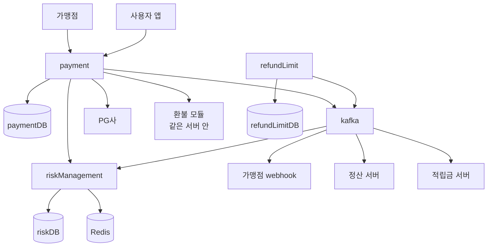
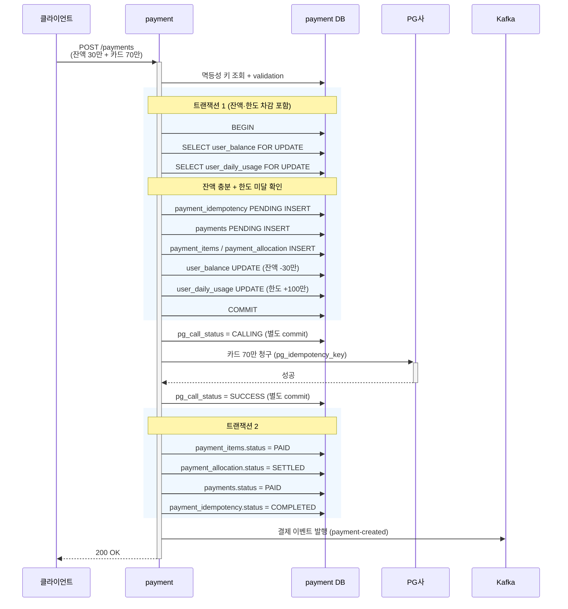
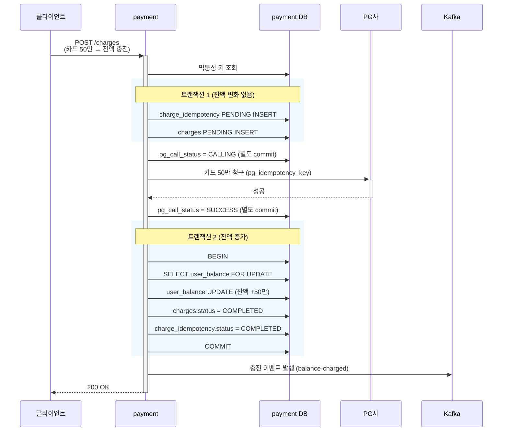
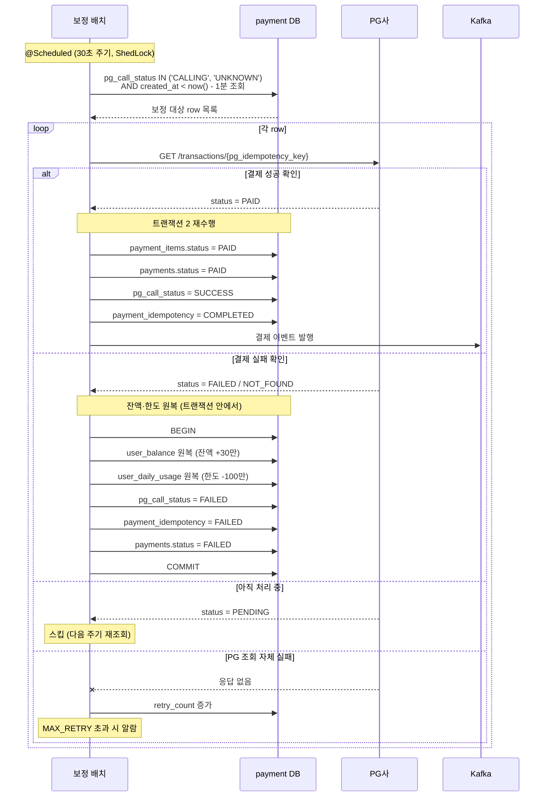
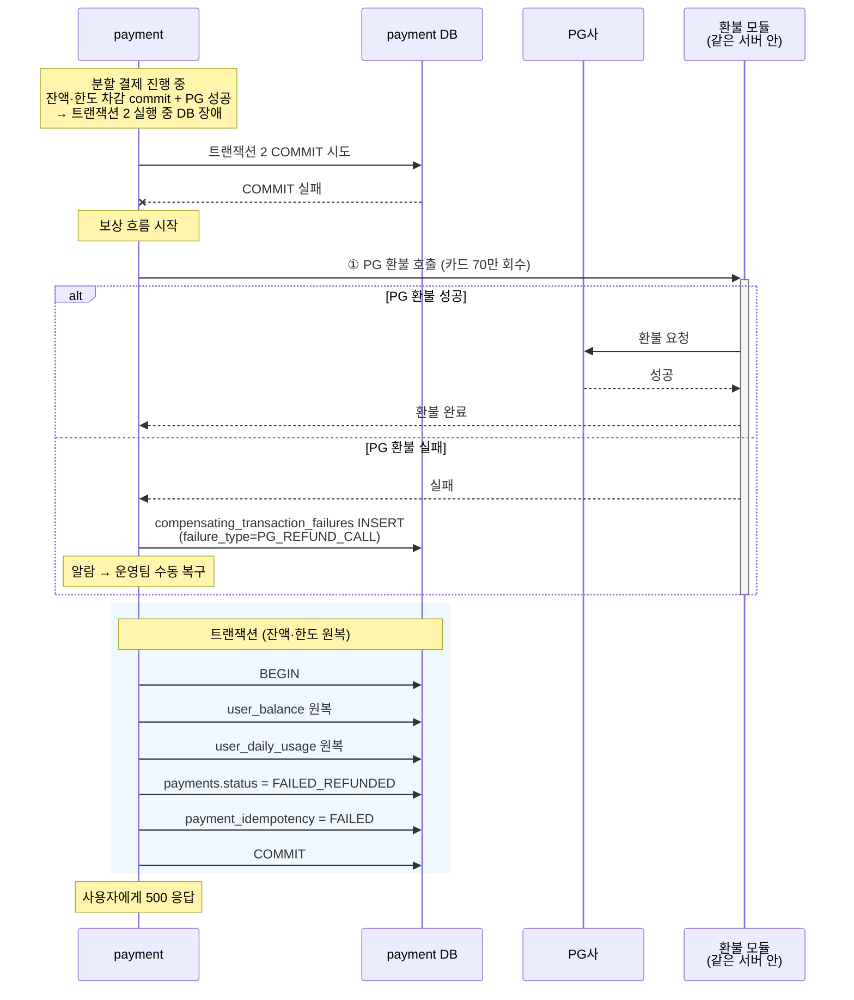
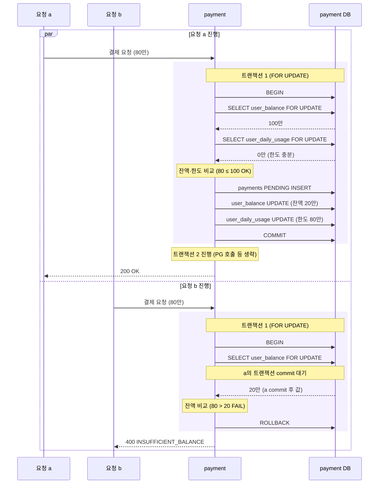

# 간편결제 시스템 디자인 리뷰 문서 (결제 로직 확장)

> 본 문서는 `payment-cancel-design_v4_5.md`(이하 "취소 문서")의 확장본이며, v0.1의 잘못된 가정(가맹점 측 결제 시스템, 재고 도메인)을 정정한 v0.2다.
>
> 본 시스템은 **네이버페이 모델의 간편결제 서비스 본체**다. 사용자가 잔액(페이 머니)과 외부 결제수단(카드/계좌)을 등록·보관하고, 가맹점이 결제 요청 시 본 시스템이 결제 수단을 조합해 처리한다.

---

## 0. 본 확장의 스코프

### 추가하는 것

- 결제 처리 API 구축 (단일 수단 / 분할 결제)
- 충전 처리 API 구축 (사용자 잔액 증가)
- 사용자 잔액 관리 (페이 머니)
- 사용자 일일 결제 한도 관리 (사기 방지)
- 결제 요청의 멱등성 (이중 결제 방지)
- 사용자 단위 동시성 처리 (같은 사용자의 동시 결제 직렬화)
- 분할 결제의 분산 트랜잭션 (잔액 + 한도 + PG 원자성)
- PG 호출 불확실성 처리 (취소 문서 패턴 재사용)
- 결제/충전 이벤트의 비동기 전파

### 명시적으로 제외하는 것

- **재고 도메인**: 본 시스템은 간편결제 본체로, 재고는 가맹점 책임 (v0.1의 가장 큰 오류 정정).
- **결제수단 등록·인증**: 결제 시점에 이미 등록된 상태로 가정. 카드 토큰화는 결제수단 도메인이 담당.
- **PG사 결제·환불 API 스펙**: PG사 문서가 진실의 원천.
- **가맹점 등록·정산**: 별도 도메인.
- **사용자 가입·인증**: 별도 도메인.

### 본 시스템의 핵심 비대칭 (확장 작업의 통찰)

v0.1에서 정리한 결제 vs 환불 비대칭에 더해, 본 시스템에는 추가 비대칭이 있다.

| 측면 | 일반 결제 | 충전 | 환불 (취소 문서) |
|---|---|---|---|
| 돈의 방향 | 사용자 → 가맹점 | 외부 (카드 등) → 사용자 잔액 | 가맹점 → 사용자 |
| 사용자 자원 변화 | 잔액 감소, 한도 누적 증가 | 잔액 증가 | 잔액 또는 카드로 환불 |
| PG 호출 의미 | 카드 청구 | 카드 청구 (잔액 충전 목적) | 환불 청구 |
| 보상 트랜잭션 | 잔액 원복 + PG 환불 호출 | 잔액 회수 (이미 증가시킨 것) + PG 환불 | 환불의 환불 → 다시 결제 상태 |
| 한도 영향 | 한도 누적 차감 | **한도 무관** (충전은 결제가 아님) | 한도 누적 원복 |

특히 **충전이 한도와 무관**하다는 점이 중요하다. 충전은 본인 잔액으로 옮기는 행위라 일일 결제 한도(사기 방지 목적)와 별개 도메인.

---

## 1. 서버 배치 결정 1: 결제·취소 합치기

> v0.1과 동일한 결론. 근거 일부 보강.

### 결정: 같은 서버 안 모듈 분리

근거 (v0.1 재정리):

1. **취소 문서 7줄의 "환불 분리" 논리는 주문 서버에서 환불을 떼어낸 것**이지 결제·취소를 분리한 것이 아님. 한 도메인 안의 라이프사이클 단계를 분리하는 것은 다른 차원의 결정.

2. **트랜잭션 경계 이점이 큼**. `payments`/`payment_items`는 결제·취소 양쪽에서 변경됨. 분리 시 두 서버가 같은 테이블에 락 경합 + 분산 트랜잭션 필요.

3. **결제 보상 시 환불 도메인 호출이 같은 서버 안 호출이 되는 이득** — 시나리오 20(분할 결제 + 트랜잭션 2 실패 시 PG 환불 필요)이 본 시스템에서 자주 발생할 수 있는 케이스인데, 같은 서버 안 모듈 호출이라 네트워크 실패 시나리오가 추가 안 됨.

4. **간편결제 모델에서 결제/취소 트래픽 비율이 다른 시스템과 다름** — 일반 쇼핑몰은 결제:취소 = 100:1 정도지만 간편결제는 50:1 정도 (간편결제 자체가 가맹점들의 통합 결제 수단이라 취소도 자주 발생). 분리 이득이 더 작음.

### 분리 진화 시그널 (변동 없음, v0.1 재인용)

트래픽 패턴 극단화, 팀 분리, 장애 격리 요구. 현재 단계에서 모두 미충족.

---

## 2. 서버 배치 결정 2: 잔액/한도 관리 — 별도 서버 vs 내부 모듈

본 시스템의 새로운 큰 결정. v0.1에서 inventory 서버를 별도로 둔 것은 잘못된 패턴 답습이었음. 본 시스템의 잔액/한도는 inventory와 다른 성격이라 재분석 필요.

### 두 안

#### 안 A: 별도 서버 (user-account, riskManagement 패턴)

```
payment 서버                  user-account 서버
├─ POST /payments             ├─ POST /balance/decrement
├─ POST /charges              ├─ POST /balance/rollback
└─ paymentDB                  ├─ POST /daily-limit/check-and-use
                              ├─ POST /daily-limit/rollback
                              └─ userAccountDB
                                  ├─ user_balance
                                  ├─ user_daily_usage
                                  └─ user_daily_limit
```

#### 안 B: 내부 모듈 (payment 서버 안에 BalanceService, LimitService)

```
payment 서버
├─ POST /payments
├─ POST /charges
├─ (내부) BalanceService → user_balance 접근
├─ (내부) LimitService → user_daily_usage 접근
└─ paymentDB
    ├─ payments / payment_items / payment_allocation
    ├─ user_balance         (같은 DB에서 트랜잭션 묶기 가능)
    ├─ user_daily_usage
    └─ user_daily_limit
```

### 비교

| 측면 | 안 A (별도 서버) | 안 B (내부 모듈) |
|---|---|---|
| 단일 책임 원칙 | 명확 (계정 도메인 분리) | 약간 위배 (payment가 잔액 직접 관리) |
| 취소 문서 7줄 논리 일관성 | riskManagement·refundLimit과 같은 패턴 | 동일 패턴 아님 (잔액은 payment 안) |
| **트랜잭션 원자성** | 분산 트랜잭션 필요 (잔액 차감 + payments INSERT) | **단일 DB 트랜잭션 가능** |
| 분할 결제 보상 복잡도 | 잔액 원복 = 외부 호출 (실패 시 보상의 보상 가능) | 잔액 원복 = 같은 트랜잭션 ROLLBACK |
| 코드 공유 | API 명세 정의 + 라이브러리 분리 | 자연스러움 |
| 배포 독립성 | 잔액 관련 변경이 payment 무관 | 결합 |
| 장애 격리 | 잔액 서버 장애 시 결제 못 함 (어차피 막힘) | 모듈 장애 = 서버 장애 |
| 운영 복잡도 | 서버 2개, DB 2개 | 단일 서버 |
| **취소 문서 패턴 재사용** | riskManagement 패턴 그대로 | 패턴이 다름 (DB 락만으로 충분) |
| 확장 시 분리 비용 | 이미 분리됨 | 미래 분리 시 큰 마이그레이션 |
| 동시성 메커니즘 | 분산 락 + DB 락 중첩 필수 | DB 락만으로 가능 (단일 서버라 인스턴스 간 직렬화 = DB 락이 처리) |

### 핵심 trade-off: 트랜잭션 원자성 vs 도메인 분리

**안 A의 가장 큰 약점**은 분할 결제 시 분산 트랜잭션이 필요하다는 점이다:

```
[안 A - 분할 결제 흐름]
1. payment: idempotency PENDING INSERT
2. payment → user-account: 잔액 30만 차감
3. payment → user-account: 한도 100만 차감
4. payment → PG: 카드 70만 청구
5. payment: payments PAID UPDATE

→ 5단계 중 어디서 실패해도 외부 호출로 보상해야 함
```

**안 B의 흐름은 더 단순**:

```
[안 B - 분할 결제 흐름]
1. BEGIN
2. idempotency PENDING + payments PENDING INSERT
3. user_balance 차감 (같은 트랜잭션)
4. user_daily_usage 차감 (같은 트랜잭션)
5. COMMIT 트랜잭션 1
6. PG 호출 (외부, 트랜잭션 밖)
7. BEGIN 트랜잭션 2
8. payments PAID + idempotency COMPLETED
9. COMMIT 트랜잭션 2

→ 5단계까지가 단일 트랜잭션이라 잔액·한도 원자성이 DB가 보장
```

차이가 큽니다. 안 B는 잔액·한도 차감이 **payments PENDING 상태 INSERT와 같은 트랜잭션 안**에서 일어남. 모든 내부 자원이 한 트랜잭션 안에 묶임. PG 호출만 외부.

### 안 A가 정당화되는 조건

- **잔액/한도가 결제 외 다른 도메인에서도 사용됨** — 예: 송금, P2P 이체, 잔액 조회 전용 API가 다른 서비스에서 자주 호출됨
- **잔액 관리 팀이 별도 조직** — 배포 독립성 가치 발생
- **잔액 DB가 결제 DB와 다른 인프라 요구** — 예: 잔액은 더 강한 백업·감사 정책 필요

### 권고: 안 B (내부 모듈)

근거:

1. **분할 결제가 메인 시나리오**이고, 그 시나리오의 핵심 어려움이 분산 트랜잭션이라면, **분산 트랜잭션을 만들지 않는 설계가 우선**. 안 A는 일부러 분산 트랜잭션을 만드는 셈.

2. **취소 문서의 riskManagement 분리 패턴과 본질적으로 다름**. riskManagement는 *환불* 한도라 결제 흐름과 결합도가 낮음(취소 요청만 한도 검사). 잔액/한도는 *모든 결제마다* 접근하는 핫패스. 패턴을 기계적으로 따라하면 안 됨.

3. **단일 서버 + 단일 DB라 동시성 메커니즘 단순**. 분산 락 불필요, DB 비관적 락만으로 충분. 운영 복잡도 큰 폭 감소.

4. **TPS 100 단계에서 도메인 분리 이득 < 분산 트랜잭션 비용**. 분리는 미래에 시그널이 명확해지면 마이그레이션.

### 안 B 채택 시 영향

- **취소 문서의 riskManagement 서버는 유지** (환불 한도 도메인 분리). 잔액/한도와 별개.
- **payment 서버가 paymentDB 안에서 모든 사용자 자원 관리**.
- **DB 락만으로 동시성 처리** — 본 문서 동시성 챕터(9장)에서 자세히 다룸.
- **확장 시점에 재분리 가능성 열어둠** — 12장 결정 사항 + 미해결 사항.

### 안 B가 한계에 부딪힐 시그널 (미래 진화)

- TPS 1000 도달 시 사용자 row가 hot row가 되어 DB 부하 폭증 → 그때 안 A로 마이그레이션 또는 11장 hot row 해결책 적용
- 잔액 도메인을 다른 서비스에서도 쓰기 시작 → 분리
- 잔액 관련 규제 변경으로 별도 인프라 요구 → 분리

---

## 3. 요구사항

### 배경

본 시스템은 사용자가 자신의 잔액(페이 머니)과 외부 결제수단(카드/계좌)을 등록·보관하고, 가맹점이 결제 요청 시 사용자가 선택한 조합으로 결제를 처리하는 **간편결제 본체**다.

취소 문서는 이미 처리된 결제의 환불 처리를 담당하는 별도 시스템이며, 본 문서는 그 결제 본체를 만드는 작업이다. 결제 자체와 충전(외부 결제수단으로 잔액 채우기)을 함께 다룬다.

### 목표

- 결제 처리 API 구축 (단일 결제수단 / 분할 결제)
- 충전 처리 API 구축 (외부 결제수단 → 사용자 잔액)
- 동일 결제·충전 요청의 중복 처리 방지 (이중 결제 방지)
- 같은 사용자의 동시 결제 직렬화 (잔액·한도 race 방지)
- 분할 결제의 분산 트랜잭션 처리 (잔액·한도·PG 원자성)
- 결제/충전 이벤트를 Kafka로 발행하여 가맹점 webhook, 정산, 적립금 시스템에 전파
- TPS 100 기준 설계, TPS 1000 / 10000 확장 고려

### 제약사항

- 현재 시스템 환경: TPS 100 (취소 문서와 동일)
- 사용자 인증·결제수단 등록은 결제 요청 시점에 이미 완료된 상태
- 결제수단 정보(카드 토큰 등)는 별도 도메인이 관리, 본 시스템은 결제수단 ID로 참조
- 가맹점은 외부 시스템이며 webhook으로 결제 결과 통보
- 외부 결제수단(카드/계좌) 청구는 PG사를 통함, PG사는 단일 PG로 가정 (다중 PG는 본 문서 범위 밖)

### 핵심 문제

| # | 문제 | 무엇이 어려운가 |
|---|---|---|
| 1 | **멱등성 (이중 결제 방지)** | 결제는 환불과 달리 payment_id가 *생성되는* 행위다. 취소 문서의 "서버가 키 생성" 패턴 적용 불가. 네트워크 타임아웃·재시도 환경에서 동일 결제가 두 번 처리되면 즉시 분쟁. 멱등성 키 정책 결정이 핵심. |
| 2 | **사용자 단위 동시성** | 같은 사용자의 동시 결제 요청이 잔액·한도라는 공유 자원에 동시 접근. 락 단위가 사용자별이라 인기 사용자 hot row 가능성은 낮지만(상품 hot row와 달리 단일 사용자가 동시에 많은 결제를 하기 어려움), **잔액과 한도 두 자원에 한 트랜잭션이 접근하는 데드락 위험 회피**가 필요. |
| 3 | **분할 결제의 분산 트랜잭션** | 한 결제가 잔액 차감 + 한도 차감 + PG 호출 세 가지를 원자적으로 수행해야 함. 2장 결정으로 잔액·한도는 단일 DB 트랜잭션이지만, **PG 호출은 어쩔 수 없는 외부 호출**이라 PG 실패·불확실 시 보상이 까다로움. 특히 PG 부분만 실패하면 내부 자원은 어떻게 처리할지 결정이 미묘. |
| 4 | **PG 호출 불확실성** | 취소 문서 시나리오 9와 같은 구조지만 **사용자 체감 손해가 더 크다** — "돈 빠졌는데 결제 안 됨"은 즉시 분쟁. 보정 배치가 PG 진실 조회 후 결정하는 패턴은 그대로 재사용 가능. |
| 5 | **결제 보상의 환불 도메인 결합** | 트랜잭션 2 실패 같은 정합성 깨짐 케이스에서 PG에 이미 청구된 부분을 환불 도메인을 호출해 회수해야 함. 잔액 차감은 내부 트랜잭션 안에서 이미 commit됐다면 별도 보상 필요. 결제와 환불·취소 시스템의 결합점. |
| 6 | **충전과 결제의 서로 다른 흐름** | 충전은 결제의 거울이 아니라 별도 흐름. 한도와 무관, 사용자 잔액이 *증가*하는 작업. PG 호출 실패 시 보상 방향도 다름 (잔액 회수). |

---

## 4. 유저 시나리오

취소 문서 2장의 구조와 톤을 따른다. 본 시스템은 결제와 충전을 모두 다루므로 시나리오를 두 그룹으로 나눈다.

### 4-1. 결제 시나리오

#### 정상 플로우

| # | 시나리오 | 결과 |
|---|---|---|
| 11 | 잔액 단독 결제 (잔액 100만, 결제 30만) | 잔액 70만 / 한도 누적 30만 / payments PAID |
| 12 | 카드 단독 결제 | 잔액 변화 없음 / 한도 누적 / PG 청구 / payments PAID |
| 13 | **분할 결제 (잔액 30만 + 카드 70만)** | 잔액 차감 + 한도 누적 + PG 청구 — **메인 시나리오** |
| 14 | 3개 수단 분할 결제 (잔액 + 카드 A + 카드 B) | 각 수단별 청구, 한 번에 처리 |

#### 엣지 케이스

**15. 동일 요청 중복 결제 시도**

사용자가 결제 버튼을 두 번 빠르게 누름. 클라이언트가 같은 `Idempotency-Key`로 재전송.

- **COMPLETED**: 기존 결과 반환 (200, 같은 응답 본문)
- **PENDING**: 409 `PAYMENT_IN_PROGRESS`
- **FAILED**: 새 키로 재요청 가능 (실패는 신규 시도 허용)
- **없음**: 신규 처리

취소 문서 시나리오 5와 다른 점: 결제 FAILED는 신규 키로 재시도 허용. 이유 — 결제 실패 원인(카드 한도 초과, PG 일시 거절)은 시간 지나면 해소될 수 있어 별개 시도로 다루는 게 자연스러움.

**16. 사용자 잔액 부족**

사용자 잔액 10만, 분할 결제 요청 (잔액 30만 + 카드 70만). 잔액이 부족함.

시스템은 **validation 단계**에서 사용자 잔액을 체크하여 부족 시 400 `INSUFFICIENT_BALANCE` 응답. 트랜잭션 시작 전이라 부담 없음.

> validation은 락 안에서 다시 한번 체크해야 함 (validation 통과 후 락 잡기 직전 다른 결제로 잔액이 줄어들 수 있음). 락 안 체크 실패 시 같은 400 응답.

**17. 사용자 일일 한도 초과**

사용자 일일 한도 500만, 누적 사용 450만, 새 결제 80만 요청. 한도 초과(450+80 > 500).

같은 패턴 — validation + 락 안 재체크. 실패 시 400 `DAILY_LIMIT_EXCEEDED`.

**18. 같은 사용자 동시 결제 요청**

사용자가 한 화면에서 결제 진행 중 다른 탭에서 동시에 결제 시도. 잔액 100만, 두 요청 각각 80만씩 (합쳐서 160만으로 잔액 초과).

시스템은 **사용자 단위 분산 락 + DB 비관적 락 중첩**으로 직렬화. 먼저 락 잡은 요청만 처리, 두 번째 요청은 첫 번째 결과에 따라 잔액·한도 재계산 후 가능 여부 결정.

- 첫 번째 80만 성공 → 잔액 20만 남음 → 두 번째 80만 거절 (400)
- 첫 번째 실패 → 두 번째 80만 그대로 시도

취소 문서의 merchant 락과 다른 점: **락 단위가 사용자**. 잔액과 한도 두 자원에 한 트랜잭션이 접근하지만 락은 하나만 잡음 (9장 동시성 챕터에서 자세히).

**19. PG 호출 명시적 실패 (분할 결제)**

분할 결제 (잔액 30만 + 카드 70만). 잔액 30만 차감 commit 완료, PG가 카드 70만 청구 거절 (도난 카드 등). 명시적 4xx 응답.

**보상 트랜잭션**: 잔액 30만 원복 + 한도 100만 누적 원복. 둘 다 내부 DB UPDATE이므로 한 트랜잭션 안에서 처리. 보상 자체 실패 위험은 매우 낮음 (단일 DB).

응답: 400 `PG_DECLINED` (PG 거절 사유 포함).

**20. PG 호출 불확실 (타임아웃)**

분할 결제 진행 중 PG 호출에서 타임아웃 발생. PG가 청구를 했는지 알 수 없음.

**핵심 원칙**: 단순 재시도하면 이중 청구 위험. **PG 진실 조회 후 결정**이 본 시스템 분산 처리 설계의 핵심 (취소 문서 시나리오 9와 동일).

응답: 즉시 500 반환. 정합성은 보정 배치가 백그라운드에서 회복하며, 클라이언트는 동일 요청 재전송으로 최종 결과 확인 가능. 보정 배치 주기는 30초 (취소 1분보다 짧음 — 결제 불확실은 사용자 체감 손해가 더 큼).

**21. 보정 배치 후 처리 분기**

PG 진실 조회 결과에 따라:

- **PG가 결제 처리함 확인**: 보정 배치가 트랜잭션 2 수행 (payments PAID + idempotency COMPLETED) + Kafka 발행. 잔액·한도는 이미 차감되어 있으니 그대로.
- **PG가 결제 안 함 확인**: 잔액 원복 + 한도 원복 + payments FAILED + idempotency FAILED.

**22. 트랜잭션 2 실패 (정합성 깨짐, 가장 위험한 케이스)**

잔액 차감 + 한도 차감(트랜잭션 1) commit 성공, PG 호출 성공, 트랜잭션 2(payments PAID UPDATE) commit 직전 DB 장애로 실패.

이 상태는: 사용자 입장에서 잔액 빠짐, 카드 청구됨, 그런데 결제 기록은 PENDING으로 남음. 사용자는 결제 화면에서 "오류" 메시지 봄.

**보상 흐름**:
1. PG에 환불 호출 (취소 문서의 환불 도메인 활용)
2. 잔액 원복
3. 한도 원복
4. payments FAILED_REFUNDED + idempotency FAILED

각 단계 실패 시 `compensating_transaction_failures` 기록 + 알람. **자동 회복 불가능한 정합성 깨짐 상태는 운영팀 채널로 빼는 게 안전** (취소 문서 패턴).

응답: 500 (정합성 깨진 상태).

> **이 시나리오가 핵심 문제 #5(결제 보상의 환불 도메인 결합)의 구체화**. 결제 시스템 안에서 환불 시스템을 호출해야 하는 시점이 명확히 드러나는 케이스.

**23. 복수 결제수단 중 PG 호출 부분 실패 (3개 수단 분할 결제)**

분할 결제 (잔액 30만 + 카드 A 40만 + 카드 B 30만). 카드 A 청구 성공, 카드 B 청구 실패.

**원자성 우선 결정** (취소 문서 시나리오 10과 동일 원칙):
1. 카드 A에 환불 호출 (취소 문서 환불 도메인)
2. 잔액 30만 원복 + 한도 100만 누적 원복

응답: 400 `PG_DECLINED` (어느 카드가 실패했는지 포함).

**24. Kafka 발행 실패**

결제 자체는 완료됐지만 가맹점 webhook 시스템에 알림이 안 감 (Kafka 일시 장애).

취소 문서 5장의 `kafka_publish_failures` 패턴 그대로 재사용. 사용자에게는 200 응답, 백그라운드 재발행 배치가 가맹점에 알림. 사용자 결제 자체는 즉시 성공, 가맹점 상태 동기화는 최대 1분 지연 (결과적 일관성).

---

### 4-2. 충전 시나리오

#### 정상 플로우

| # | 시나리오 | 결과 |
|---|---|---|
| 25 | 단일 결제수단 충전 (카드로 잔액 50만 충전) | PG 청구 → 잔액 +50만 |
| 26 | 충전 후 즉시 결제 | 충전 commit 후 잔액 반영 → 다음 결제에서 사용 가능 |

#### 엣지 케이스

**27. 충전 요청 중복**

사용자가 충전 버튼 두 번 누름. 결제 멱등성 패턴 그대로 — 같은 `Idempotency-Key`로 중복 차단.

**28. 충전 시 PG 호출 명시적 실패**

PG가 카드 청구 거절. 잔액은 아직 증가 안 시킨 상태(트랜잭션 2 전)라 보상 불필요. 그냥 charges FAILED 마킹.

응답: 400 `PG_DECLINED`.

**29. 충전 시 PG 호출 불확실**

결제와 같은 패턴 — 보정 배치가 PG 진실 조회 후 결정.

- PG 청구 성공 확인 → 잔액 증가 + charges COMPLETED + Kafka 발행
- PG 청구 실패 확인 → charges FAILED (잔액 변화 없음, 보상 불필요)

> **결제와의 차이**: 충전은 잔액 증가가 트랜잭션 2 안에 있으므로, PG 호출 전에 잔액이 미리 증가되지 않음. 그래서 PG 실패 시 보상이 단순.

**30. 충전 후 즉시 결제 시 동시성**

충전 commit 직후 사용자가 바로 결제 시도. 두 요청이 거의 동시에 들어옴.

- 충전 트랜잭션 2 commit → 잔액 증가 반영
- 결제 트랜잭션 1 시작 → 사용자 락 획득 → 잔액 확인

같은 사용자 락이라 자연 직렬화. 충전이 먼저 commit되면 결제는 증가된 잔액 보고 진행. 충전이 commit 전에 결제가 락 잡으면 결제는 충전 전 잔액 기준으로 처리(부족하면 거절). **둘 다 정합성 측면에서 안전**.

---

## 5. 시스템 아키텍처



### 서버별 책임

| 서버 | 책임 |
|---|---|
| payment | **결제·취소·충전 요청 진입점**, 멱등성 관리, 처리 오케스트레이션, **잔액·한도 관리 (내부 모듈)**, PG 호출, Kafka 이벤트 발행 |
| riskManagement | (취소 문서 동일) 판매업체별 일일 환불 한도 관리 |
| refundLimit | (취소 문서 동일) 판매업체별 일일 환불 한도 설정값 관리 |
| merchantWebhook | **(신규)** Kafka 결제 이벤트 수신 후 가맹점에 webhook 전송 |
| settlement | **(신규)** Kafka 결제 이벤트 수신 후 정산 처리 (본 프로젝트 범위 밖) |
| rewards | **(신규)** Kafka 결제/충전 이벤트 수신 후 적립금 적립 (본 프로젝트 범위 밖) |

### 인프라 컴포넌트

- **Kafka**: 비동기 이벤트 브로커. 새 토픽 추가 (`payment-created`, `balance-charged`)
- **Redis**: riskManagement 전용 (취소 문서 그대로). **payment 서버는 Redis 미사용** — 2장 결정에 따라 단일 서버 단일 DB 트랜잭션이라 분산 락 불필요.
- **각 DB**: 서버별 격리. paymentDB가 잔액·한도 테이블 포함.

### 아키텍처 설계 결정

**payment 서버가 Redis 미사용**이라는 점이 취소 문서 아키텍처와 가장 큰 차이. 2장의 안 B(내부 모듈) 결정의 직접적 결과. 사용자 단위 동시성은 DB 비관적 락만으로 처리 (9장 동시성 챕터).

> 정확히는 "payment 서버 자체가 다중 인스턴스로 운영될 때 인스턴스 간 직렬화는 어떻게 하는가"라는 질문이 남는데, 이건 **DB 비관적 락이 인스턴스 간에도 작동**한다는 사실로 해결. 같은 row를 두 인스턴스가 동시에 `SELECT FOR UPDATE` 하면 DB가 한 쪽만 통과시킴. Redis 락의 1차 방어선이 없어지지만, payment 서버는 사용자 단위라 락 경합 빈도가 낮아 DB 부하 문제는 작음 (9장에서 자세히).

**환불 모듈이 같은 서버 안**이라는 점이 2번째 큰 결정. 1장의 결제·취소 합치기 결정의 결과. 시나리오 22(트랜잭션 2 실패)의 보상이 같은 서버 안 모듈 호출로 단순화됨.

**가맹점 webhook이 별도 서버**인 이유: 가맹점은 외부 시스템이라 응답 시간·실패율이 통제 불가. payment 서버가 직접 webhook 호출하면 가맹점 응답 시간이 사용자 응답에 누적. Kafka로 비동기 분리.

---

## 6. 핵심 플로우

취소 문서 4장 패턴을 따른다. **정상 처리 2개(결제·충전) + 장애 케이스 3개**.

### 6-1. 정상 결제 처리 — 분할 결제 (Happy Path)



**다이어그램이 보여주는 핵심 설계 결정:**

- **트랜잭션 1이 잔액·한도까지 포함** — 2장 결정의 직접적 결과. 안 A(별도 서버)였다면 잔액·한도가 외부 호출이라 별도 commit이 필요했음.
- **DB 비관적 락(`FOR UPDATE`) 사용** — 같은 사용자의 동시 결제 직렬화. 분산 락 없음. 9장에서 자세히.
- **잔액·한도 두 row를 한 트랜잭션에서 락** — 데드락 회피 위해 **고정 순서로 락** (balance 먼저 → usage 나중). 9장.
- **`pg_call_status` 별도 commit** — 취소 문서 4-1 패턴 그대로. PG 호출 중 서버 다운 시 CALLING 상태가 사라지면 보정 배치 인지 못 함.
- **트랜잭션 2가 단순** — 잔액·한도는 이미 트랜잭션 1에서 처리되어 트랜잭션 2는 상태 갱신만. 락 점유 시간 최소화.

### 6-2. 정상 충전 처리 (Happy Path)



**다이어그램이 보여주는 핵심 설계 결정:**

- **트랜잭션 1에 잔액 변화 없음** — 결제와 큰 차이. 충전은 잔액 *증가*라 PG 성공 확인 후에 증가시키는 게 안전.
- **잔액 증가가 트랜잭션 2 안** — PG 청구 성공 확인 → 잔액 증가. 순서가 명확해서 PG 실패 시 보상 불필요.
- **한도 미접근** — 충전은 결제가 아니라 한도와 무관 (0장 비대칭 표).
- **결제와 다른 idempotency 테이블** — `charge_idempotency`. 두 도메인의 idempotency를 같은 테이블에 두는 것도 가능하지만 분리. 7장에서 결정 근거.

### 6-3. PG 호출 불확실성 보정 (시나리오 20, 21)

취소 문서 4-3 패턴 그대로. 차이점만 강조하는 다이어그램.



**취소 문서 4-3과의 차이:**
- **주기 30초 / 유예 1분** (취소는 1분 / 3분) — 사용자 체감 손해가 결제 쪽이 더 큼.
- **보상이 잔액·한도 원복** — 같은 트랜잭션 안에서 처리. riskManagement RPC 호출 같은 외부 호출 없음. 2장 결정의 이득이 보정 배치에서도 드러남.
- **결제 성공 확인 시 Kafka 발행도 함께** — 가맹점·정산 시스템이 알아야 함. 충전 보정도 같은 패턴 (단순 상태 갱신).

### 6-4. 결제 보상 — 환불 도메인 호출 (시나리오 22)



**다이어그램이 보여주는 핵심 설계 결정:**

- **보상 순서: PG 환불 먼저, 잔액·한도 원복 나중** — v0.1과 다른 결정. 이유: PG 환불은 외부 호출이라 실패 가능성이 높음 + 시간이 걸림. 만약 잔액 원복을 먼저 하고 PG 환불이 실패하면 "잔액은 돌아갔는데 카드는 청구된 상태"라 사용자 입장에서 더 혼란. PG부터 회복 시도 후 잔액 처리하는 것이 안전.
- **잔액·한도 원복은 한 트랜잭션** — 단일 DB라 가능. 외부 호출 없음.
- **`payments.status = FAILED_REFUNDED`** — v0.1과 같은 결정. 일반 FAILED와 분석 패턴 다름.
- **`failure_type` 컬럼 활용** — 보상 실패의 종류 구분 (PG_REFUND_CALL / BALANCE_ROLLBACK / LIMIT_ROLLBACK). 알람 라우팅 + 운영 분석.

### 6-5. 같은 사용자 동시 결제 (시나리오 18)



**다이어그램이 보여주는 핵심 설계 결정:**

- **DB 비관적 락만으로 직렬화** — Redis 분산 락 없음. 2장 결정의 결과.
- **`FOR UPDATE` 락이 인스턴스 간에도 작동** — 서버 다중 인스턴스여도 같은 row를 두 인스턴스가 동시 락하지 못함. DB가 보장.
- **락 순서: 잔액 → 한도** — 두 row를 락하는 순서를 고정하여 데드락 회피. 9장.
- **취소 문서 4-2와 다른 점**: 4-2는 분산 락 + DB 락 중첩. 여기는 DB 락만. 이유는 락 자원이 다름 — merchant 한도는 인기 merchant에 트래픽 집중 가능하지만, 사용자별 자원은 단일 사용자가 동시에 많은 결제를 하기 어려워 hot row 위험이 낮음 (9장 추가 분석).

---

## 7. Database Design

취소 문서 5장의 DB 컨벤션(FK 미설정, VARCHAR(64) UUID PK, BIGINT 금액 원 단위, INSERT-only 감사 로그)을 그대로 따른다.

### 7-1. payments / payment_items (취소 문서 확장)

#### `payments` (status 확장)

취소 문서의 status 값에 결제 처리 단계 추가.

| status | 의미 |
|---|---|
| PENDING | 결제 처리 중 (트랜잭션 1 ~ 트랜잭션 2 commit 전) |
| PAID | 결제 완료 |
| FAILED | 결제 실패 (PG 호출 전·중) |
| FAILED_REFUNDED | 트랜잭션 2 실패 후 환불 처리됨 (시나리오 22) |
| PARTIALLY_CANCELLED | (취소 문서 동일) |
| CANCELLED | (취소 문서 동일) |

테이블 DDL은 취소 문서 그대로 — `user_id` 컬럼 추가 권고. 취소 문서는 user_id 미설치 결정(378줄)이지만, 본 시스템은 잔액·한도 도메인이 추가되어 user_id가 결제·잔액·한도를 잇는 핵심 키가 됨.

```sql
-- 취소 문서 DDL에 추가
ALTER TABLE payments
    ADD COLUMN user_id VARCHAR(64) NOT NULL,
    ADD INDEX idx_user_id (user_id);
```

**`user_id` 추가 근거**:
- 본 시스템은 결제 시 사용자 잔액·한도 join이 핫패스
- 사용자별 결제 이력 조회가 운영·고객지원 핫패스 (취소 문서는 order_id만으로 충분했지만 간편결제는 사용자가 1차 식별자)
- 취소 문서 378줄의 "정규화 관점에서 제외" 결정은 가맹점 측 결제 시스템 가정 — 본 시스템은 다름

#### `payment_items` (변경 없음)

취소 문서 그대로. status에 PENDING 추가만.

#### `payment_allocation` (신규, 분할 결제의 핵심)

```sql
CREATE TABLE payment_allocation (
    id                  VARCHAR(64)  PRIMARY KEY,           -- UUID
    payment_id          VARCHAR(64)  NOT NULL,              -- 어느 결제인지
    method_type         VARCHAR(32)  NOT NULL,              -- BALANCE / CARD / ACCOUNT
    method_id           VARCHAR(64)  NULL,                  -- 결제수단 ID (BALANCE는 NULL)
    amount              BIGINT       NOT NULL,              -- 이 수단으로 차감할 금액
    status              VARCHAR(32)  NOT NULL,              -- PENDING / SETTLED / FAILED / REFUNDED
    pg_transaction_id   VARCHAR(128) NULL,                  -- PG 응답의 트랜잭션 ID (외부 결제수단만)
    created_at          TIMESTAMP    NOT NULL DEFAULT NOW(),
    updated_at          TIMESTAMP    NOT NULL DEFAULT NOW() ON UPDATE NOW(),

    INDEX idx_payment_id (payment_id),
    INDEX idx_method_id (method_id),
    INDEX idx_status_created (status, created_at)
);
```

**설계 결정:**

- **한 결제에 N개 allocation** — 분할 결제는 메인 시나리오. 단일 수단 결제는 1개 allocation으로 표현.
- **`method_type`으로 잔액/카드/계좌 구분** — 각 타입별 처리 흐름이 다름 (잔액은 내부 DB, 카드·계좌는 PG 호출).
- **`method_id`가 NULL 가능** — BALANCE는 결제수단 ID 없음 (사용자 자체가 식별자). 카드·계좌는 외부 결제수단 도메인의 ID 참조.
- **`pg_transaction_id` 별도 컬럼** — PG 응답의 트랜잭션 ID 보존. 환불 처리 시 PG에 이 ID로 환불 요청. `pg_idempotency_key`와 다름 (우리가 보낸 키 vs PG가 응답한 ID).
- **status 4가지**: PENDING(처리 중), SETTLED(이 수단 청구 완료), FAILED(이 수단 실패), REFUNDED(시나리오 22 후처리).

### 7-2. user_balance / user_daily_usage / user_daily_limit (신규, 본 시스템 핵심)

#### `user_balance` (사용자 잔액)

```sql
CREATE TABLE user_balance (
    user_id         VARCHAR(64) PRIMARY KEY,    -- 사용자 식별자
    balance         BIGINT      NOT NULL DEFAULT 0,    -- 현재 잔액 (원 단위)
    created_at      TIMESTAMP   NOT NULL DEFAULT NOW(),
    updated_at      TIMESTAMP   NOT NULL DEFAULT NOW() ON UPDATE NOW()
);
```

**설계 결정:**

- **row 1개당 사용자** — 동시성 락 영역 최소화. 취소 문서 refund_usage 패턴 동일.
- **`balance` 음수 방지** — 애플리케이션 레벨에서 보장 (트랜잭션 안에서 차감 전 확인). DB CHECK 제약 추가 가능하지만 마이그레이션 비용 고려 미설치.
- **`version` 컬럼 미설치** — 비관적 락 사용이라 낙관적 락 대비 불필요. 향후 hot row 문제 시 도입 검토.
- **충전·환불·결제 모두 본 테이블 UPDATE** — 거래 종류는 `balance_history`에서 추적.

#### `balance_history` (신규, 잔액 변경 감사 로그)

```sql
CREATE TABLE balance_history (
    id              BIGINT       AUTO_INCREMENT PRIMARY KEY,
    user_id         VARCHAR(64)  NOT NULL,
    action          VARCHAR(16)  NOT NULL,    -- CHARGE / PAYMENT / REFUND / ROLLBACK
    amount_change   BIGINT       NOT NULL,    -- 변경량 (부호 포함, +충전/-결제)
    balance_after   BIGINT       NOT NULL,    -- 변경 후 잔액
    payment_id      VARCHAR(64)  NULL,        -- 관련 결제 (CHARGE는 charge_id, 환불 시 별도)
    charge_id       VARCHAR(64)  NULL,        -- 관련 충전 (충전 시)
    created_at      TIMESTAMP    NOT NULL DEFAULT NOW(),

    INDEX idx_user_created (user_id, created_at),
    INDEX idx_payment_id (payment_id),
    INDEX idx_charge_id (charge_id)
);
```

**설계 결정:**

- **INSERT only** — 취소 문서 refund_usage_history 패턴.
- **`balance_after` 컬럼** — 절대값 직접 저장. 운영 시 "특정 시점 잔액" 조회가 핫패스라 누적 계산 회피.
- **`payment_id` / `charge_id` 분리 컬럼** — 거래 종류별 참조. JSON 컬럼으로 합치는 것도 가능하지만 두 필드만 있어 명시적 컬럼이 더 단순.
- **돈 다루는 시스템의 법적 의무** — 잔액 변경 이력 보존은 보통 5~10년 의무. 본 테이블이 그 역할. 파티셔닝·아카이빙 전략은 운영 시점 결정.

#### `user_daily_usage` (사용자 일일 결제 누적)

```sql
CREATE TABLE user_daily_usage (
    user_id         VARCHAR(64) PRIMARY KEY,
    used_amount     BIGINT      NOT NULL DEFAULT 0,    -- 오늘 누적 결제 금액
    last_reset_date DATE        NOT NULL,              -- 마지막 리셋 날짜
    created_at      TIMESTAMP   NOT NULL DEFAULT NOW(),
    updated_at      TIMESTAMP   NOT NULL DEFAULT NOW() ON UPDATE NOW()
);
```

**설계 결정 (취소 문서 `refund_usage`와의 차이점):**

- **`merchant_id`가 아니라 `user_id`가 PK** — 한도 단위가 다름. 환불 한도는 판매업체별, 결제 한도는 사용자별.
- **자정 배치가 일별 리셋** — 취소 문서 패턴 그대로. `user_daily_usage_daily_snapshot`도 같은 패턴으로 추가 (DDL 생략, refund_usage_daily_snapshot과 동일 구조).
- **충전은 본 테이블에 영향 없음** — 0장 비대칭 표.

#### `user_daily_limit` (사용자 일일 한도 설정값)

```sql
CREATE TABLE user_daily_limit (
    user_id         VARCHAR(64) PRIMARY KEY,
    daily_limit     BIGINT      NOT NULL,    -- 일일 결제 한도
    created_at      TIMESTAMP   NOT NULL DEFAULT NOW(),
    updated_at      TIMESTAMP   NOT NULL DEFAULT NOW() ON UPDATE NOW()
);
```

**설계 결정:**

- **사용자별 한도값** — 본인인증 등급에 따라 다른 값 가능 (KYC 등급 기반). 기본값은 별도 정책 테이블에서 관리 (본 문서 범위 밖).
- **변경 이력은 별도 테이블** — 취소 문서의 `merchant_daily_limit_history` 패턴 그대로. `user_daily_limit_history` 추가 (DDL 생략, 컬럼은 user_id / daily_limit / changed_by / created_at).
- **본 테이블은 진실의 원천 + 핫패스** — 취소 문서의 refundLimit DB와 riskDB 분리 패턴 대신 단일 테이블. 이유: 잔액·한도가 같은 paymentDB라 분리 이득 없음.

### 7-3. payment_idempotency / charge_idempotency

#### `payment_idempotency` (신규)

```sql
CREATE TABLE payment_idempotency (
    idempotency_key      VARCHAR(64)  PRIMARY KEY,    -- 클라이언트 생성 UUID
    user_id              VARCHAR(64)  NOT NULL,       -- 사용자 격리 (보안)
    order_id             VARCHAR(64)  NOT NULL,       -- 가맹점 주문 ID
    payment_id           VARCHAR(64)  NULL,           -- 생성된 결제 ID
    status               VARCHAR(32)  NOT NULL,       -- PENDING / COMPLETED / FAILED
    pg_call_status       VARCHAR(32)  NOT NULL DEFAULT 'NOT_CALLED',
    pg_idempotency_key   VARCHAR(128) NULL,
    retry_count          INT          NOT NULL DEFAULT 0,
    expired_at           TIMESTAMP    NOT NULL,
    created_at           TIMESTAMP    NOT NULL DEFAULT NOW(),
    updated_at           TIMESTAMP    NOT NULL DEFAULT NOW() ON UPDATE NOW(),

    UNIQUE KEY uk_user_idempotency (user_id, idempotency_key),
    INDEX idx_order_id (order_id),
    INDEX idx_payment_id (payment_id),
    INDEX idx_status_created (status, created_at),
    INDEX idx_pg_call_status_created (pg_call_status, created_at)
);
```

**설계 결정 (취소 문서 `cancel_idempotency`와의 차이점 중심):**

- **클라이언트 생성 키 + user_id 조합 검증** — 같은 클라이언트 키를 다른 사용자가 보내도 별개 처리. 보안 완화. 단순 PK는 idempotency_key지만 실제 검증은 (user_id, idempotency_key) 조합.

> **UNIQUE 제약은 (user_id, idempotency_key)** — PK는 idempotency_key 단독으로 두지만 실제 의미는 사용자별 격리. PK 형태 결정 두 안:
> - 안 1: PK = idempotency_key (현재), UNIQUE (user_id, idempotency_key)
> - 안 2: PK = (user_id, idempotency_key) 복합키
> 
> 안 1 채택. 이유: idempotency_key가 UUID v4면 충돌 확률 사실상 0이라 단독 PK가 안전. 복합키는 다른 테이블에서 참조 시 비용 증가.

- **`payment_id`가 NULLABLE** — payment_id가 생성되는 시점이 트랜잭션 1 중간이라 멱등성 row INSERT 시점에는 아직 없음. UPDATE로 채움.

#### `charge_idempotency` (신규, 충전용)

```sql
CREATE TABLE charge_idempotency (
    idempotency_key      VARCHAR(64)  PRIMARY KEY,
    user_id              VARCHAR(64)  NOT NULL,
    charge_id            VARCHAR(64)  NULL,
    status               VARCHAR(32)  NOT NULL,
    pg_call_status       VARCHAR(32)  NOT NULL DEFAULT 'NOT_CALLED',
    pg_idempotency_key   VARCHAR(128) NULL,
    retry_count          INT          NOT NULL DEFAULT 0,
    expired_at           TIMESTAMP    NOT NULL,
    created_at           TIMESTAMP    NOT NULL DEFAULT NOW(),
    updated_at           TIMESTAMP    NOT NULL DEFAULT NOW() ON UPDATE NOW(),

    UNIQUE KEY uk_user_idempotency (user_id, idempotency_key),
    INDEX idx_charge_id (charge_id),
    INDEX idx_status_created (status, created_at),
    INDEX idx_pg_call_status_created (pg_call_status, created_at)
);
```

**`payment_idempotency`와 분리 결정 근거:**

세 가지 idempotency 테이블 (cancel_idempotency, payment_idempotency, charge_idempotency)을 하나로 합칠지 분리할지 결정.

| 안 | 장점 | 단점 |
|---|---|---|
| 통합 1개 | 단순성 | 컬럼이 도메인마다 다름(payment_id NULL, charge_id NULL, ...), 핫패스 쿼리 패턴 다름 |
| 분리 3개 | 도메인 명확, 인덱스 최적 | 코드 중복 (3개 비슷한 구조 처리) |

**분리 선택** (v0.1과 동일 입장). 이유:
- 컬럼 차이가 미묘함 (payment vs charge vs cancel)
- 운영 시 도메인별 분석 패턴이 다름
- 코드 중복은 베이스 클래스·공통 모듈로 추출 가능
- 통합 시 type 컬럼으로 분기되는 쿼리가 인덱스 효율 떨어뜨림

### 7-4. charges (신규, 충전 기록)

```sql
CREATE TABLE charges (
    id                  VARCHAR(64)  PRIMARY KEY,
    user_id             VARCHAR(64)  NOT NULL,
    method_type         VARCHAR(32)  NOT NULL,    -- CARD / ACCOUNT
    method_id           VARCHAR(64)  NOT NULL,
    amount              BIGINT       NOT NULL,
    status              VARCHAR(32)  NOT NULL,    -- PENDING / COMPLETED / FAILED
    pg_transaction_id   VARCHAR(128) NULL,
    created_at          TIMESTAMP    NOT NULL DEFAULT NOW(),
    updated_at          TIMESTAMP    NOT NULL DEFAULT NOW() ON UPDATE NOW(),

    INDEX idx_user_created (user_id, created_at),
    INDEX idx_status_created (status, created_at)
);
```

**설계 결정:**

- **`payments` 테이블과 분리** — 충전은 결제가 아니라 별도 도메인. payment_allocation에 method_type=BALANCE만 처리하는 케이스로 묶는 것도 가능하지만, 충전은 가맹점·주문 무관이라 의미적으로 명확히 분리하는 게 좋음.
- **`payment_allocation`과 구조 유사** — method_type, amount, pg_transaction_id가 같은 의미. 두 도메인이 PG 호출 처리 측면에서 닮음.

### 7-5. 보조 테이블 (취소 문서 패턴 재사용)

#### `compensating_transaction_failures` (취소 문서 + `failure_type` 컬럼 추가)

```sql
-- 취소 문서 DDL에 컬럼 추가
ALTER TABLE compensating_transaction_failures
    ADD COLUMN failure_type VARCHAR(32) NOT NULL DEFAULT 'REFUND_LIMIT_ROLLBACK',
    ADD COLUMN charge_id VARCHAR(64) NULL;
```

**failure_type 값:**
- `REFUND_LIMIT_ROLLBACK` (취소 문서 기존)
- `BALANCE_ROLLBACK` (결제 시나리오 22, 잔액 원복 실패)
- `USAGE_ROLLBACK` (결제 시나리오 22, 한도 원복 실패)
- `PG_REFUND_CALL` (결제 시나리오 22, PG 환불 호출 실패)

#### `kafka_publish_failures` (변경 없음)

취소 문서 그대로 재사용. 새 토픽(`payment-created`, `balance-charged`)도 자연스럽게 수용.

---

## 8. API Design

### 8-1. Public API

#### POST /payments

결제 요청. 가맹점이 호출하거나, 사용자 앱이 직접 호출 (가맹점 SDK 통해).

**Headers:**
| 헤더 | 필수 | 설명 |
|---|---|---|
| `Idempotency-Key` | Yes | 클라이언트 생성 UUID v4 |
| `Authorization` | Yes | 사용자 토큰 또는 가맹점 API 키 |

**Request Body:**
```json
{
  "user_id": "USR_001",
  "order_id": "MERCH_ORD_123",
  "total_amount": 1000000,
  "allocations": [
    {"method_type": "BALANCE", "amount": 300000},
    {"method_type": "CARD", "method_id": "CARD_abc", "amount": 700000}
  ]
}
```

| 필드 | 타입 | 필수 | 설명 |
|---|---|---|---|
| user_id | string | Yes | 사용자 식별자 |
| order_id | string | Yes | 가맹점 주문 ID (외부 참조) |
| total_amount | bigint | Yes | 총 결제 금액 |
| allocations | array | Yes | 결제수단별 분배 |
| allocations[].method_type | string | Yes | BALANCE / CARD / ACCOUNT |
| allocations[].method_id | string | No | BALANCE는 생략, 외부 수단은 필수 |
| allocations[].amount | bigint | Yes | 이 수단으로 차감할 금액 |

> **서버 측 검증**:
> - `sum(allocations[].amount) == total_amount` (불일치 시 400)
> - 같은 method_id가 중복되지 않음
> - BALANCE allocation은 최대 1개

**Response Body (성공):**
```json
{
  "payment_id": "PAY_001",
  "status": "PAID",
  "user_id": "USR_001",
  "order_id": "MERCH_ORD_123",
  "total_amount": 1000000,
  "paid_at": "2024-11-15T10:23:45Z",
  "allocations": [
    {"method_type": "BALANCE", "amount": 300000, "status": "SETTLED"},
    {"method_type": "CARD", "method_id": "CARD_abc", "amount": 700000, "status": "SETTLED", "pg_transaction_id": "PG_xyz"}
  ]
}
```

**HTTP 상태 코드:**
| 코드 | 의미 | 시나리오 |
|---|---|---|
| 200 OK | 결제 성공 | 정상 처리 |
| 200 OK | 멱등 응답 | 동일 Idempotency-Key 재요청 |
| 400 | INSUFFICIENT_BALANCE | 잔액 부족 |
| 400 | DAILY_LIMIT_EXCEEDED | 일일 한도 초과 |
| 400 | PG_DECLINED | PG가 카드 청구 거절 |
| 400 | INVALID_REQUEST | 금액 불일치, 잘못된 method 등 |
| 400 | MISSING_IDEMPOTENCY_KEY | Idempotency-Key 헤더 없음 |
| 409 | PAYMENT_IN_PROGRESS | 같은 멱등성 키 요청이 처리 중 |
| 500 | INTERNAL_ERROR | 보상 트랜잭션 실패 (시나리오 22) |
| 503 | PG_UNAVAILABLE | PG 서비스 장애 |

#### POST /charges

충전 요청. 사용자 앱이 호출.

**Headers**: `/payments`와 동일.

**Request Body:**
```json
{
  "user_id": "USR_001",
  "method_type": "CARD",
  "method_id": "CARD_abc",
  "amount": 500000
}
```

**Response Body (성공):**
```json
{
  "charge_id": "CHG_001",
  "status": "COMPLETED",
  "user_id": "USR_001",
  "amount": 500000,
  "balance_after": 800000,
  "charged_at": "2024-11-15T10:25:30Z"
}
```

**HTTP 상태 코드**: PG_DECLINED / PG_UNAVAILABLE / 멱등성 관련은 결제와 동일. 잔액 부족·한도 초과는 충전에 없음.

#### POST /payments/{paymentId}/cancel

(취소 문서 그대로) 결제 취소.

### 8-2. 내부 API

본 시스템은 잔액·한도가 내부 모듈이라 외부 API 없음. 외부 호출은 PG, riskManagement(환불 한도) 뿐.

PG 호출 API는 PG사 문서 영역 — 본 문서 범위 밖.

riskManagement 호출은 환불 흐름에서만 사용 (취소 문서 그대로).

#### 내부 API 호출 정책

취소 문서 6-2 그대로. Timeout 3초, Retry 1회.

---

## 9. 동시성 설계

본 시스템의 동시성은 취소 문서 7장과 **본질적으로 다른 모델**이다. 같은 도메인의 락 메커니즘이지만 메커니즘 자체가 단순화됨.

### 9-1. DB 비관적 락 단독 (분산 락 없음)

2장의 안 B 결정에 따라, 본 시스템은 **DB 비관적 락만 사용**한다. 취소 문서의 분산 락 + DB 락 중첩이 아님.

```
[취소 문서 패턴 - 환불 한도]
  Redis 분산 락 (외부)
    └─ DB FOR UPDATE (내부)

[본 시스템 패턴 - 결제]
  DB FOR UPDATE (단독)
```

**왜 분산 락 없이 가능한가:**

DB 비관적 락은 인스턴스 간에도 작동한다. 같은 row를 두 인스턴스가 동시에 `SELECT FOR UPDATE` 하면 DB가 한 쪽만 통과시킴. 분산 락은 *DB 부하 절감* 목적이 컸지(취소 문서 7-1), DB 락 자체는 정합성 보장. 본 시스템은 DB 부하 우려가 작아 분산 락을 생략 가능.

**왜 DB 부하 우려가 작은가:**

| 측면 | 취소 문서 (merchant 한도) | 본 시스템 (사용자 자원) |
|---|---|---|
| 락 단위 | merchant_id | user_id |
| Hot row 위험 | 인기 merchant에 트래픽 집중 가능 | 단일 사용자의 동시 결제는 드뭄 |
| 동시 요청 수 | 같은 merchant에 수십~수백 동시 가능 | 같은 사용자는 보통 1~3 동시 |
| DB 락 대기 큐 | 길어질 수 있음 → 커넥션 풀 부담 | 짧음 |

→ 사용자 단위 동시성은 자연 분산이라 DB 락만으로 충분.

### 9-2. 잔액·한도 두 row 락 — 데드락 회피

본 시스템 동시성의 가장 미묘한 부분. 결제 트랜잭션 1에서 **두 row(user_balance + user_daily_usage)를 락**한다. 락 순서가 일관되지 않으면 데드락 발생.

**데드락 시나리오 (잘못된 설계):**

```
요청 a: balance 락 획득 → usage 락 시도 (대기)
요청 b: usage 락 획득 → balance 락 시도 (대기)
→ 무한 대기 (DB가 timeout으로 한 쪽 죽임)
```

**회피 방법: 고정 순서로 락**

```
모든 요청이 항상 balance → usage 순서로 락
요청 a: balance 락 획득 → usage 락 획득 → 처리 → commit
요청 b: balance 락 시도 (a 대기) → a commit 후 진행
```

**더 강한 대안: 한 SELECT로 두 row 락**

```sql
SELECT * FROM user_balance, user_daily_usage 
WHERE user_balance.user_id = ? AND user_daily_usage.user_id = ?
FOR UPDATE;
```

이 방식은 DB가 락 순서를 알아서 정렬하므로 데드락 자동 회피. 단점은 두 테이블 join이라 옵티마이저 의존 — DB 버전·통계에 따라 동작 다를 수 있음. **고정 순서 락이 더 명시적이고 안전**.

### 9-3. 락 키와 트랜잭션 경계

**락 키**: `user_balance.user_id`, `user_daily_usage.user_id`. 두 row 모두 PK가 user_id라 락 단위가 자연스럽게 사용자.

**트랜잭션 경계**: 6-1 시퀀스에서 본 것처럼 트랜잭션 1이 잔액·한도 차감까지 포함. PG 호출은 트랜잭션 *밖*. 트랜잭션 안에서 외부 호출하면 락이 외부 응답 시간만큼 잡혀 부담 큼 (취소 문서 4-1 동일 원칙).

```
[트랜잭션 1 안에서 일어나는 일]
1. SELECT user_balance FOR UPDATE
2. SELECT user_daily_usage FOR UPDATE
3. 잔액·한도 비교
4. payment_idempotency PENDING INSERT
5. payments PENDING INSERT
6. payment_allocation INSERT
7. user_balance UPDATE (차감)
8. user_daily_usage UPDATE (차감)
9. COMMIT → 락 자동 해제
```

**락 점유 시간**: 단일 DB 안 작업이라 수십 ms 수준. PG 호출(수백 ms~수 초)과 비교하면 무시할 수준. 같은 사용자의 다음 요청이 길게 대기할 가능성 낮음.

### 9-4. 타임아웃 정책

DB 비관적 락의 타임아웃은 두 가지:

| 타임아웃 | 값 (권고) | 의미 |
|---|---|---|
| `innodb_lock_wait_timeout` | 3초 | 락 대기 한도 |
| 트랜잭션 자체 timeout | 10초 | 전체 트랜잭션 한도 |

락 대기 3초 초과 시 DB가 예외 던짐 → 애플리케이션이 잡아서 409 `PAYMENT_IN_PROGRESS` 응답.

> **취소 문서의 waitTime/leaseTime과 다름**. 취소 문서는 Redis 락의 두 timeout이지만, 본 시스템은 DB 락이라 DB 설정값만 적용.

### 9-5. 잔액 음수 방지

잔액 차감 후 음수가 되지 않도록 확인:

```sql
-- 차감 전 확인 (애플리케이션 코드)
SELECT balance FROM user_balance WHERE user_id = ? FOR UPDATE;
-- balance >= 차감금액 확인 후
UPDATE user_balance SET balance = balance - ? WHERE user_id = ?;
```

**대안: WHERE 조건으로 원자적 차감**

```sql
UPDATE user_balance 
SET balance = balance - ? 
WHERE user_id = ? AND balance >= ?;
-- affected rows == 0이면 잔액 부족
```

이 방식은 락 + 차감을 한 쿼리로 합침. 단점: 한도 체크와 분리되어 두 단계 처리 필요. **명시적 SELECT FOR UPDATE + UPDATE가 더 단순** (한도 체크와 함께 처리 가능).

### 9-6. Fail-Closed 미적용 — 단순성

취소 문서 7-3의 Fail-Closed 정책(Redis 장애 시 503)이 본 시스템에는 적용 안 됨. Redis를 안 쓰니까. DB 장애 시는 어차피 503이 자연스럽게 발생.

### 9-7. 향후 분산 락 도입 시그널

**TPS 증가 또는 특정 사용자 hot row가 발생하면** 분산 락 도입 검토:

- 사용자가 봇처럼 초당 수십 요청 보내는 케이스 (사기·테스트 등)
- 비즈니스 이벤트로 동시 트래픽이 한 사용자에 몰리는 케이스 (예: 적립금 출금 이벤트)

이때는 취소 문서 패턴(Redis 분산 락 + DB 락 중첩)으로 전환. 코드 베이스에 분산 락 추상화 미리 마련해두면 마이그레이션 비용 작음.

---

## 10. Kafka Design

취소 문서 8장 패턴 확장.

### 10-1. 토픽 구성

| 토픽 | 발행자 | 컨슈머 | 파티션 키 | 파티션 (초기) |
|---|---|---|---|---|
| `payment-created` | **(신규)** payment | merchantWebhook, settlement, rewards | `user_id` | 12 |
| `balance-charged` | **(신규)** payment | rewards | `user_id` | 6 |
| `payment-cancelled` | (기존) payment | merchantWebhook, settlement | `payment_id` | 6~12 |
| `limit-updated` | (기존) refundLimit | riskManagement | `merchant_id` | 6 |

### 10-2. 파티션 키 결정 — `user_id` 채택

가장 미묘한 결정. v0.1은 `payment_id`를 썼지만, 본 시스템 모델에서는 `user_id`가 더 적절.

**`user_id` 채택 근거:**

1. **같은 사용자의 결제·취소 시퀀스 순서 보장 필요** — 한 사용자가 결제 → 부분 취소 → 전체 취소 시퀀스를 보낼 때, 가맹점 webhook이나 적립금 시스템이 순서대로 받아야 함. `payment_id`로 키 잡으면 같은 사용자의 다른 결제와 다른 파티션이 됨.

2. **취소 문서의 `payment-cancelled`와 일관성 깨짐** — 취소 문서는 `payment_id` 키. 본 시스템에서 같은 payment_id의 결제·취소를 다른 키로 나누는 게 어색. 하지만 본 시스템에서 더 큰 단위로 보고 싶은 게 사용자 시퀀스.

**대안 비교:**

| 파티션 키 | 장점 | 단점 |
|---|---|---|
| `payment_id` | UUID라 해시 분산 균등, hot partition 없음 | 같은 사용자의 시퀀스 순서 보장 안 됨 |
| `user_id` | 사용자 단위 순서 보장 | 활발한 사용자에 hot partition 가능 (사기성 사용자 등) |

**결정: `user_id`로 통일** (취소 문서의 `payment-cancelled`도 변경 권고).

근거:
- 같은 사용자의 이벤트 시퀀스 보장이 비즈니스 가치 큼
- hot partition 위험은 일반 사용자에게는 낮음 (사용자가 초당 수십 결제는 비정상)
- 사기성·봇 사용자 대응은 별도 도메인(fraud 시스템)에서 처리

> **취소 문서 변경 권고**: 취소 문서의 `payment-cancelled` 파티션 키를 `payment_id` → `user_id`로 변경. 본 변경은 운영 시점에 마이그레이션 필요 (파티션 키 변경은 같은 키의 매핑이 깨질 수 있어 신중).

### 10-3. 컨슈머 수와 토픽별 처리

**`payment-created`의 3 컨슈머 그룹:**

- `merchant-webhook.payment-created`: 가맹점 webhook 전송
- `settlement.payment-created`: 정산 데이터 적재
- `rewards.payment-created`: 적립금 처리

각자 독립 컨슈머 그룹이라 한 컨슈머의 지연이 다른 컨슈머에 영향 없음. 운영 시 컨슈머별 lag 모니터링 필수.

**`balance-charged`의 1 컨슈머 그룹:**

- `rewards.balance-charged`: 충전 이벤트 적립금 (충전 금액의 일정 % 보상 등)

가맹점·정산은 충전과 무관 (충전은 본 시스템 안에서 끝나는 거래).

### 10-4. 프로듀서/컨슈머 설정

취소 문서 8-2, 8-3 그대로 적용:
- `acks=all`, `min.insync.replicas=2`
- 매뉴얼 커밋 (at-least-once)
- `enable.idempotence=true`
- Cooperative Rebalancing + Static Membership

### 10-5. 발행 실패 처리

취소 문서 8-4의 `kafka_publish_failures` + 1분 주기 재발행 배치 그대로.

---

## 11. TPS 확장 전략

취소 문서 9장 패턴에 결제 관점 보강.

### 11-1. 단계별 전략

#### TPS 100 (현재)

본 문서 기본 설계로 충분. DB 비관적 락만으로 동시성 처리.

#### TPS 1000

**Scale Up + 부하 분산 강화**

- payment 서버 인스턴스 다중화 (DB 락이 인스턴스 간 직렬화 자동 처리)
- DB Read Replica (잔액 조회 핫패스 분산 — 단, 차감은 Master)
- Kafka 컨슈머 인스턴스 증설

이 단계에서 **DB 락만으로도 처리 가능**할 가능성 높음. 사용자 단위 분산 효과 덕분.

#### TPS 10000

**Scale Out + 분산 락 도입 검토**

- payment 서버 다중 인스턴스 (이미 1000부터)
- **분산 락 도입** — 사용자 hot row 발생 시 DB 부하 보호용. 취소 문서 패턴(Redis 분산 락 + DB 락 중첩)으로 전환.
- Kafka 브로커·파티션 확장
- DB 샤딩 검토 (user_id 기준)

### 11-2. 사용자 hot row 문제

취소 문서의 merchant hot row 문제와 비교.

| 측면 | 환불 한도 hot row | 사용자 결제 hot row |
|---|---|---|
| 발생 빈도 | 인기 merchant 환불 시점 (분기·시즌) | 활발한 사용자 (사기·테스트 봇) |
| 강도 | 높음 (같은 merchant 수백 동시) | 일반적으로 낮음 (사용자 한 명 동시 결제 드뭄) |
| 대응 우선순위 | 취소 문서에서 sub-bucket 검토 | TPS 10000+ 시점에 분산 락 도입 |

**사용자 hot row의 sub-bucket 부적합** — 사용자 잔액은 분할 의미 없음 (1만 원이 5천 원 × 2가 아님). 한도는 분할 가능하지만 사용자별 한도 분할은 운영 가치 낮음. **사용자 hot row 대응은 분산 락 추가가 정답**.

### 11-3. 잔액 row의 한계와 확장 전략

본 시스템 확장 시 진짜 병목은 **잔액 row 자체**. 사용자가 많아질수록 row 수가 폭증 (사용자 1M = row 1M). 단일 테이블의 한계 도달 시점이 옴.

**TPS 10000+ 단계에서 검토:**

- **샤딩 (user_id 해시)** — 사용자별로 다른 DB 인스턴스. 자연 분산.
- **CQRS 도입** — 잔액 조회 (Read)와 차감 (Write) 분리. 조회는 Replica, 차감은 Master.
- **이벤트 소싱 검토** — 잔액 자체를 컬럼이 아니라 balance_history의 합으로 계산. 단점: 조회 비용 폭증, 추가 캐시 필요.

→ TPS 10000 시점에 진지하게 검토. 본 문서 범위 밖.

---

## 12. 결정 사항 요약

| 영역 | 결정 | 근거 |
|---|---|---|
| **서버 구성** | | |
| 결제·취소 합치기 | 같은 서버 안 모듈 분리 | 1장 (v0.1 그대로) |
| 잔액·한도 위치 | **payment 서버 안 내부 모듈** | 2장 — 단일 트랜잭션 원자성 이득 > 도메인 분리 가치 |
| 환불 모듈도 같은 서버 안 | 시나리오 22 보상의 단순화 | 1장 합치기 결정의 직접 이득 |
| **멱등성** | | |
| 결제 키 생성 주체 | 클라이언트 (Idempotency-Key 헤더, UUID v4) | 사용자 의도 분리, 업계 표준. 취소와 다른 정책 |
| 사용자 격리 | (user_id, idempotency_key) UNIQUE | 다른 사용자 키 충돌 회피 |
| 테이블 분리 | payment / charge / cancel 3개 | 컬럼 차이, 핫패스 쿼리 패턴 다름 |
| **사용자 동시성** | | |
| 락 메커니즘 | **DB 비관적 락 단독** (Redis 분산 락 없음) | 사용자 단위 자연 분산, 단일 서버 단일 DB |
| 락 단위 | user_id | 잔액·한도 모두 사용자별 자원 |
| 두 row 락 순서 | 고정 순서 (balance → usage) | 데드락 회피 |
| Lock wait timeout | 3초 | 409 응답으로 사용자 경험 보호 |
| **분할 결제** | | |
| allocation 모델 | payment_allocation 테이블 1:N | 분할 결제가 메인 시나리오 |
| 트랜잭션 1 범위 | 잔액 차감 + 한도 차감 포함 | 단일 DB라 가능. 외부 호출 트랜잭션 밖 원칙 유지 |
| PG 부분 실패 시 | 잔액·한도 원복 (단일 트랜잭션) | 보상이 단순 |
| **PG 호출** | | |
| pg_call_status 패턴 | 취소 문서 그대로 | CALLING/SUCCESS 별도 commit |
| 보정 배치 주기 | 30초 (취소 1분) | 사용자 체감 손해 더 큼 |
| 유예 시간 | 1분 (취소 3분) | 빠른 회복 우선 |
| **결제 보상 (시나리오 22)** | | |
| 보상 순서 | PG 환불 → 잔액 원복 → 한도 원복 | 외부 호출 먼저 시도 (실패 가능성 큼) |
| PG 환불 호출 | 같은 서버 안 환불 모듈 | 네트워크 실패 시나리오 회피 |
| 새 status | FAILED_REFUNDED | FAILED와 분석 패턴 다름 |
| failure_type 컬럼 | BALANCE / USAGE / PG_REFUND 등 | 알람 라우팅 |
| **충전** | | |
| 별도 도메인 | charges / charge_idempotency 테이블 | 결제와 의미·흐름 다름 |
| 잔액 증가 시점 | 트랜잭션 2 안 (PG 성공 후) | PG 실패 시 보상 불필요 |
| 한도 무관 | 충전은 결제가 아님 | 0장 비대칭 표 |
| **DB 설계** | | |
| user_id 추가 | payments 테이블에 컬럼 추가 | 결제·잔액·한도 join 키 |
| 잔액 음수 방지 | 애플리케이션 레벨 (트랜잭션 안 SELECT 후 비교) | DB CHECK 미설치 |
| balance_history | INSERT only 감사 로그 | 법적 의무 + 운영 추적 |
| payment_allocation 분리 | 분할 결제 표현 핵심 | payment_items와 다른 차원 |
| **Kafka** | | |
| 새 토픽 | payment-created, balance-charged | 결제·충전 이벤트 전파 |
| 파티션 키 | **user_id** (취소 문서 변경 권고) | 같은 사용자 시퀀스 순서 보장 |
| 컨슈머 (payment-created) | merchantWebhook / settlement / rewards | 3개 독립 그룹 |
| **확장성** | | |
| TPS 1000까지 | DB 락 단독 유지 | 사용자 단위 자연 분산 |
| TPS 10000+ | 분산 락 추가 + 샤딩 검토 | 사용자 hot row + 잔액 row 수 폭증 |

---

## 13. 미해결 사항 / 추후 결정 필요

본 문서를 작성하면서 추측하지 않고 명시적으로 보류한 사항들.

1. **다중 PG 지원** — 본 문서는 단일 PG 가정. 카드사·결제수단별 다른 PG로 라우팅 시 PG 추상화 + 라우팅 정책 필요.

2. **자동 충전 (잔액 부족 시 자동으로 카드에서 충전 후 결제)** — 사용자 경험 측면 가치 큰 기능이지만 트랜잭션 흐름이 복잡. 본 문서 범위 밖.

3. **사용자 인증 등급별 한도** — KYC 등급에 따라 한도 다르게 설정 필요. 본 문서는 한도값 자체만 다루고 등급 매핑은 별도 도메인.

4. **잔액 출금 (페이 머니 → 외부 계좌)** — 본 문서는 충전만 다룸. 출금은 별도 도메인으로 분리 또는 본 시스템 확장 필요.

5. **결제수단 도메인 통합** — 본 문서는 method_id로 외부 참조만 함. 결제수단 등록·관리·토큰화는 별도 도메인 가정.

6. **분할 결제의 부분 환불 정책** — 잔액 30만 + 카드 70만으로 결제한 후 50만 환불 시 어느 수단으로 환불할지. 사용자가 선택? 자동? 본 문서 범위 밖 (환불 도메인 확장 시 결정).

7. **취소 문서의 파티션 키 마이그레이션** — `payment-cancelled` 키를 `payment_id` → `user_id`로 변경 권고. 운영 시점에 키 매핑 깨짐 회피 마이그레이션 전략 필요.

8. **잔액 단순 음수 방지의 한계** — 동시성 상에선 안전하지만, 정산·환불·보정 배치 흐름에서 음수 발생 가능성 점검 필요. 운영 시 정합성 모니터링 dashboard 설계.

---
